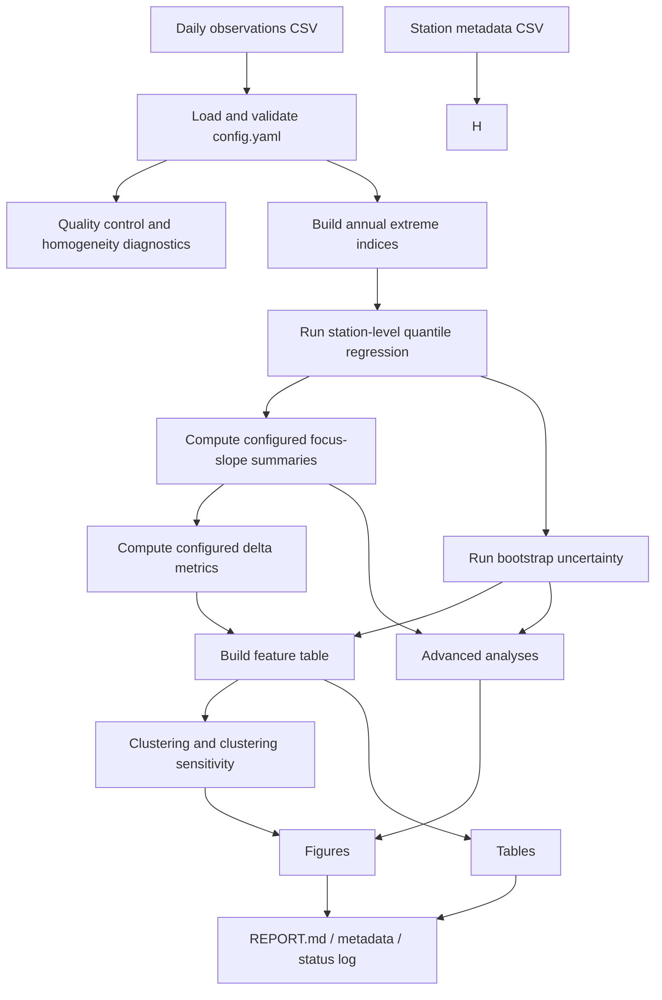

# PaperBarbosaFanLiJun

This repository contains a full end-to-end Python pipeline for station-based analysis of temperature-extreme indices. The workflow builds annual warm/cool extreme indices from daily observations, fits station-level quantile regression, estimates uncertainty with bootstrap resampling, derives asymmetric trend metrics, clusters stations by trend structure, runs several sensitivity analyses, and exports publication-oriented tables, figures, metadata, and summary reports.

The current codebase is now configuration-driven. Core analysis behavior is controlled from `config.yaml`, including quantiles, delta definitions, bootstrap settings, clustering features, plotting quantile selections, QC thresholds, and many output settings. The intent is that analysis logic should be changed through configuration rather than by editing hard-coded values in the source.

## What The Pipeline Does

At a high level, the workflow answers four connected questions:

1. How have annual warm and cool temperature-extreme indices changed over time at each station?
2. Do those trends differ across the distribution rather than only in the mean?
3. How uncertain are quantile-specific slopes and derived asymmetry metrics?
4. Can stations be grouped into interpretable regional trend signatures?

The pipeline supports:

- annual extreme-index construction from daily observations
- station-level quantile regression on a configurable full quantile grid
- configurable focus quantiles for summary outputs
- configurable delta metrics derived from focus-quantile slopes
- bootstrap uncertainty using several resampling methods
- station clustering with optional collinearity screening
- homogeneity and data-quality diagnostics
- advanced sensitivity and publication-oriented analyses
- figure export for station, regional, and spatial summaries

## Run

The entry point is:

```bash
python run_analysis.py --config config.yaml
```

`--config` is required. The pipeline validates the configuration before running. If required settings are missing or inconsistent, the run stops with a configuration error instead of silently falling back to hidden defaults.

## Main Inputs

The pipeline expects two tabular inputs defined in `config.yaml`:

- `paths.data_csv`: daily station observations
- `paths.station_csv`: station metadata

The daily table is expected to contain the columns mapped in `config.yaml` under `data`, typically including:

- station id
- station name
- year
- month
- day
- Tmin
- Tmax
- Tmean
- precipitation

The station table is used for:

- geographic joins
- elevation / latitude / longitude based analyses
- map generation
- driver analysis

## Configuration-Driven Design

The current repository is organized around a central principle:

- analysis choices should be declared in `config.yaml`
- source code should interpret configuration, validate it, and execute accordingly

The validation layer lives in [src/paper_pipeline/config_utils.py](/d:/Pooya/w/GitHub/HydroCodeIR/PaperBarbosaFanLiJun/src/paper_pipeline/config_utils.py). It currently enforces several important rules, including:

- required config keys must exist
- `focus_quantiles` must be explicitly provided
- `sensitivity_check_quantiles` must be a subset of `focus_quantiles`
- plot-specific quantile selections must satisfy expected subset rules
- `primary_delta` must exist in `delta_definitions`
- every configured delta must reference focus-quantile slope columns
- DPI, QC thresholds, and time scaling must be valid positive values

This means the code no longer assumes fixed quantiles like `0.05`, `0.50`, and `0.95` as universal truths. Those values are only used if you choose them in the config.

## High-Level Workflow



## Pipeline Stages

### 1. Data Quality And Homogeneity

Implemented in [src/paper_pipeline/data_quality.py](/d:/Pooya/w/GitHub/HydroCodeIR/PaperBarbosaFanLiJun/src/paper_pipeline/data_quality.py).

This stage:

- parses dates from year / month / day columns
- checks duplicates and basic consistency
- evaluates completeness of Tmin / Tmax / Tmean
- constructs annual mean temperature series for QC
- runs Pettitt, SNHT, and Buishand-style diagnostics
- evaluates raw and detrended homogeneity flags

The thresholds for this stage are now configurable through:

- `quality_control.homogeneity_alpha`
- `quality_control.homogeneity_permutations`
- `index_construction.annual_min_valid_coverage_pct`

Primary outputs:

- `outputs/tables/data_quality_station_summary.csv`
- `outputs/tables/data_homogeneity_tests_station_summary.csv`
- `outputs/tables/data_quality_homogeneity_overview.csv`
- `outputs/figures/ijoc_data_quality_homogeneity.<save_format>`

### 2. Annual Extreme Index Construction

Implemented in [src/paper_pipeline/indices.py](/d:/Pooya/w/GitHub/HydroCodeIR/PaperBarbosaFanLiJun/src/paper_pipeline/indices.py).

This stage:

- removes leap-day observations if configured
- builds no-leap day-of-year climatology
- computes moving-window daily percentile thresholds by station
- derives annual warm/cool extreme indices from configured index definitions

The behavior is controlled by:

- `index_construction.reference_years`
- `index_construction.percentile_window_days`
- `index_construction.lower_percentile`
- `index_construction.upper_percentile`
- `index_construction.drop_feb29`
- `indices`

Primary output:

- `outputs/tables/annual_extreme_indices.csv`

### 3. Station-Level Quantile Regression

Implemented in [src/paper_pipeline/quantile.py](/d:/Pooya/w/GitHub/HydroCodeIR/PaperBarbosaFanLiJun/src/paper_pipeline/quantile.py).

For each station and index, the pipeline:

- fits a full quantile profile over `quantile_regression.full_quantiles`
- keeps summary outputs for `quantile_regression.focus_quantiles`
- estimates an OLS benchmark slope
- scales time according to `quantile_regression.time_scale_years`

Important behavior:

- if a station has fewer than `min_years_required_to_run`, the row is retained but slopes become `NaN`
- short records can still be flagged for publication caution via `min_years_recommended_for_publication`
- fitting uses a small-sample exact fallback for short series and `statsmodels.QuantReg` for longer series

Primary outputs:

- `outputs/tables/qr_all_quantiles_long.csv`
- `outputs/tables/qr_focus_slopes_and_bootstrap_summary.csv`

### 4. Configured Delta Metrics

Also handled through [src/paper_pipeline/quantile.py](/d:/Pooya/w/GitHub/HydroCodeIR/PaperBarbosaFanLiJun/src/paper_pipeline/quantile.py) and [src/paper_pipeline/config_utils.py](/d:/Pooya/w/GitHub/HydroCodeIR/PaperBarbosaFanLiJun/src/paper_pipeline/config_utils.py).

Delta metrics are no longer fixed assumptions. They are defined in:

- `feature_engineering.delta_definitions`
- `feature_engineering.primary_delta`

Example:

```yaml
feature_engineering:
  primary_delta: Delta1
  delta_definitions:
    Delta1:
      - slope_0.95
      - slope_0.05
```

Meaning:

- `Delta1 = slope_0.95 - slope_0.05`

Any configured delta is computed automatically after focus slopes are available. The primary delta is used in several default outputs such as:

- delta uncertainty plots
- main delta map
- report summaries
- some regional / driver analyses

### 5. Bootstrap Uncertainty

Implemented mainly in [src/paper_pipeline/quantile.py](/d:/Pooya/w/GitHub/HydroCodeIR/PaperBarbosaFanLiJun/src/paper_pipeline/quantile.py), with a deeper sensitivity rerun in [src/paper_pipeline/bootstrap_depth_sensitivity.py](/d:/Pooya/w/GitHub/HydroCodeIR/PaperBarbosaFanLiJun/src/paper_pipeline/bootstrap_depth_sensitivity.py).

Supported methods:

- `moving_block`
- `meboot`
- `residual`
- `iid`

Configured through:

- `bootstrap.enabled`
- `bootstrap.method`
- `bootstrap.n_reps`
- `bootstrap.block_length`
- `bootstrap.block_length_rule`
- `bootstrap.min_block_length`
- `bootstrap.max_block_length`
- `bootstrap.alpha`

For each station/index, bootstrap resampling produces:

- bootstrap means
- bootstrap standard deviations
- bootstrap medians
- bootstrap confidence intervals
- derived bootstrap summaries for configured deltas

Optional long output:

- `outputs/tables/bootstrap_distributions_long.csv`

### 6. Sensitivity Flags

Implemented in [src/paper_pipeline/quantile.py](/d:/Pooya/w/GitHub/HydroCodeIR/PaperBarbosaFanLiJun/src/paper_pipeline/quantile.py).

The pipeline compares:

- analytic CI significance
- bootstrap CI significance

for the quantiles listed under:

- `quantile_regression.sensitivity_check_quantiles`

These generate fields like:

- `analytic_sig_<tau>`
- `bootstrap_sig_<tau>`
- `sig_agree_<tau>`
- `sensitivity_status_<tau>`

### 7. Feature Table And Clustering

Implemented in:

- [src/paper_pipeline/clustering.py](/d:/Pooya/w/GitHub/HydroCodeIR/PaperBarbosaFanLiJun/src/paper_pipeline/clustering.py)
- [src/paper_pipeline/clustering_sensitivity.py](/d:/Pooya/w/GitHub/HydroCodeIR/PaperBarbosaFanLiJun/src/paper_pipeline/clustering_sensitivity.py)

The feature table is built from:

- focus quantile slopes
- configured delta metrics
- bootstrap summaries
- sensitivity columns

Clustering behavior is controlled by:

- `clustering.algorithm`
- `clustering.linkage`
- `clustering.metric`
- `clustering.n_clusters`
- `clustering.standardize`
- `clustering.feature_mode`
- `clustering.simple_features`
- `clustering.uncertainty_features`
- `clustering.collinearity_screen.*`

Supported algorithms:

- `hierarchical`
- `kmeans`

Primary outputs:

- `outputs/tables/clustering_feature_table.csv`
- `outputs/tables/cluster_assignments.csv`
- `outputs/tables/clustering_feature_screening_summary.csv`
- `outputs/tables/cluster_assignments_reduced_features.csv`
- `outputs/tables/cluster_robustness_summary.csv`
- `outputs/tables/alternative_clustering_sensitivity_summary.csv`

### 8. Plot Generation

Implemented in [src/paper_pipeline/plotting.py](/d:/Pooya/w/GitHub/HydroCodeIR/PaperBarbosaFanLiJun/src/paper_pipeline/plotting.py).

Plotting is now partly controlled by:

- `plots.dpi`
- `plots.default_figure_dpi`
- `plots.save_format`
- `plots.heatmap_station_order`
- `plots.quantile_selections.*`
- `spatial_visualization.*`

Major figure families include:

- data coverage
- regional quantile profiles
- station heatmaps
- delta uncertainty plots
- clustering dendrograms
- station maps
- primary delta maps
- split-period comparisons
- representative-station panels
- station paper-style figures
- quantile-specific slope maps
- bootstrap distribution figures
- quantile-specific dendrogram figures
- robustness synthesis figures

Representative outputs:

- `outputs/figures/data_coverage_by_station.<save_format>`
- `outputs/figures/region_quantile_slopes_<index>.<save_format>`
- `outputs/figures/station_focus_heatmap_<index>.<save_format>`
- `outputs/figures/delta_uncertainty_<index>.<save_format>`
- `outputs/figures/map_<index>_<metric>.<save_format>`
- `outputs/figures/ijoc_main_<primary_delta>_maps.<save_format>`
- `outputs/figures/paper2_station_figures/...`
- `outputs/figures/paper2_figure3_quantile_maps/...`
- `outputs/figures/paper1_station_figures/...`
- `outputs/figures/paper1_quantile_dendrograms/...`

### 9. Advanced Analyses

Implemented in [src/paper_pipeline/advanced_analysis.py](/d:/Pooya/w/GitHub/HydroCodeIR/PaperBarbosaFanLiJun/src/paper_pipeline/advanced_analysis.py).

Modules include:

- spatial inference
- reference-period sensitivity
- bootstrap-method sensitivity
- interpolation sensitivity
- driver analysis
- regionalization summaries
- spatial validation of clusters

Controlled by:

- `advanced_analyses.spatial_inference`
- `advanced_analyses.method_sensitivity`
- `advanced_analyses.driver_analysis`
- `advanced_analyses.regionalization`
- `advanced_analyses.bootstrap_depth_sensitivity`
- `advanced_analyses.alternative_clustering_methods`

### 10. Reporting And Metadata

Implemented in:

- [src/paper_pipeline/reporting.py](/d:/Pooya/w/GitHub/HydroCodeIR/PaperBarbosaFanLiJun/src/paper_pipeline/reporting.py)
- [src/paper_pipeline/pipeline.py](/d:/Pooya/w/GitHub/HydroCodeIR/PaperBarbosaFanLiJun/src/paper_pipeline/pipeline.py)

Generated outputs:

- `outputs/run_metadata.json`
- `outputs/run_status.txt`
- `outputs/REPORT.md`

`run_metadata.json` records:

- project name
- analysis year range
- number of years
- number of stations
- bootstrap repetitions
- focus quantiles

`REPORT.md` summarizes:

- data audit information
- short-record warnings
- top stations by primary delta
- sensitivity status counts
- clustering results
- advanced analysis highlights

## Current Repository Structure

Core files:

- [run_analysis.py](/d:/Pooya/w/GitHub/HydroCodeIR/PaperBarbosaFanLiJun/run_analysis.py): CLI entry point
- [config.yaml](/d:/Pooya/w/GitHub/HydroCodeIR/PaperBarbosaFanLiJun/config.yaml): single source of analysis configuration
- [README.md](/d:/Pooya/w/GitHub/HydroCodeIR/PaperBarbosaFanLiJun/README.md): project guide

Pipeline modules:

- [src/paper_pipeline/pipeline.py](/d:/Pooya/w/GitHub/HydroCodeIR/PaperBarbosaFanLiJun/src/paper_pipeline/pipeline.py): orchestration of the full workflow
- [src/paper_pipeline/config_utils.py](/d:/Pooya/w/GitHub/HydroCodeIR/PaperBarbosaFanLiJun/src/paper_pipeline/config_utils.py): config accessors and validation rules
- [src/paper_pipeline/indices.py](/d:/Pooya/w/GitHub/HydroCodeIR/PaperBarbosaFanLiJun/src/paper_pipeline/indices.py): annual extreme-index construction
- [src/paper_pipeline/quantile.py](/d:/Pooya/w/GitHub/HydroCodeIR/PaperBarbosaFanLiJun/src/paper_pipeline/quantile.py): quantile regression, OLS, bootstrap, and delta computation
- [src/paper_pipeline/clustering.py](/d:/Pooya/w/GitHub/HydroCodeIR/PaperBarbosaFanLiJun/src/paper_pipeline/clustering.py): feature engineering and clustering
- [src/paper_pipeline/plotting.py](/d:/Pooya/w/GitHub/HydroCodeIR/PaperBarbosaFanLiJun/src/paper_pipeline/plotting.py): figure generation
- [src/paper_pipeline/reporting.py](/d:/Pooya/w/GitHub/HydroCodeIR/PaperBarbosaFanLiJun/src/paper_pipeline/reporting.py): Markdown report generation
- [src/paper_pipeline/data_quality.py](/d:/Pooya/w/GitHub/HydroCodeIR/PaperBarbosaFanLiJun/src/paper_pipeline/data_quality.py): QC and homogeneity diagnostics
- [src/paper_pipeline/advanced_analysis.py](/d:/Pooya/w/GitHub/HydroCodeIR/PaperBarbosaFanLiJun/src/paper_pipeline/advanced_analysis.py): advanced publication analyses
- [src/paper_pipeline/bootstrap_depth_sensitivity.py](/d:/Pooya/w/GitHub/HydroCodeIR/PaperBarbosaFanLiJun/src/paper_pipeline/bootstrap_depth_sensitivity.py): deeper bootstrap reruns
- [src/paper_pipeline/clustering_sensitivity.py](/d:/Pooya/w/GitHub/HydroCodeIR/PaperBarbosaFanLiJun/src/paper_pipeline/clustering_sensitivity.py): alternative clustering comparisons
- [src/paper_pipeline/homogeneity_sensitivity.py](/d:/Pooya/w/GitHub/HydroCodeIR/PaperBarbosaFanLiJun/src/paper_pipeline/homogeneity_sensitivity.py): exclusion sensitivity after QC flags
- [src/paper_pipeline/year_config.py](/d:/Pooya/w/GitHub/HydroCodeIR/PaperBarbosaFanLiJun/src/paper_pipeline/year_config.py): year-range helpers and period logic
- [src/paper_pipeline/math_utils.py](/d:/Pooya/w/GitHub/HydroCodeIR/PaperBarbosaFanLiJun/src/paper_pipeline/math_utils.py): helper utilities

## Main Output Layout

After a successful run, the output directory contains at least:

- `outputs/tables/`
- `outputs/figures/`
- `outputs/REPORT.md`
- `outputs/run_metadata.json`
- `outputs/run_status.txt`

The exact set of files depends on:

- whether bootstrap is enabled
- whether clustering is enabled
- which advanced analyses are enabled
- which quantile selections are configured

## Notes On Dynamic Configuration

The most important change in the current repository version is that several concepts are now configuration-owned:

- quantile selections are explicit
- sensitivity quantiles are explicit
- delta definitions are explicit
- primary delta is explicit
- time scaling is explicit
- QC alpha and permutation counts are explicit
- plot DPI is explicit

In practical terms, if you want to change the scientific setup, you should first change `config.yaml`.

Typical examples:

1. Change focus quantiles:
   update `quantile_regression.focus_quantiles`

2. Change the meaning of the primary asymmetry metric:
   update `feature_engineering.primary_delta` and `feature_engineering.delta_definitions`

3. Change slope units from per decade to per year:
   set `quantile_regression.time_scale_years: 1` and `time_unit_label: year`

4. Change which quantiles appear in figures:
   update `plots.quantile_selections.*`

5. Change bootstrap method:
   update `bootstrap.method`

## Important Caveats

- Quantile regression and bootstrap can be computationally expensive, especially with dense quantile grids and many stations.
- Interpolated map surfaces are visual aids, not substitutes for observed station values.
- Clustering is exploratory and sensitive to feature selection, distance metric, and standardization choices.
- If you introduce new delta definitions, make sure their operands refer to focus-quantile slope columns that actually exist.
- If you narrow `focus_quantiles`, update plot quantile selections and advanced analysis metric lists so they remain consistent.

## Recommended Editing Workflow

When adapting this repository for a new study:

1. Update paths and column mappings in `config.yaml`.
2. Confirm the analysis year range.
3. Confirm index definitions and reference-period logic.
4. Explicitly set focus quantiles and delta definitions.
5. Adjust bootstrap, clustering, and advanced-analysis settings.
6. Run:

```bash
python run_analysis.py --config config.yaml
```

7. Review:

- `outputs/run_status.txt`
- `outputs/run_metadata.json`
- `outputs/REPORT.md`
- key tables and figures

## Versioning Recommendation

Because the pipeline is now highly configuration-driven, it is a good idea to archive:

- the exact `config.yaml`
- the generated `run_metadata.json`
- the git commit hash of the repository

for every manuscript-facing run.
