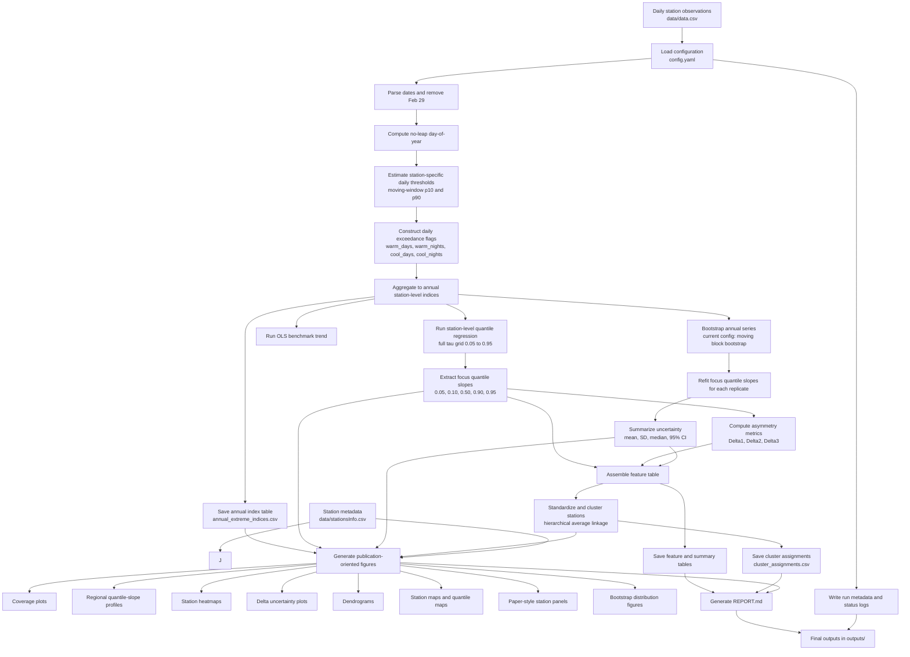

# PaperBarbosaFanLiJun

This repository implements a complete end-to-end Python workflow for analyzing temperature-extreme indices at station scale, estimating distribution-sensitive temporal trends with quantile regression, quantifying uncertainty with bootstrap resampling, grouping stations by trend behavior, and exporting publication-oriented tables, maps, and figures.

## Purpose

The pipeline was designed to answer three connected questions:

1. How have annual warm and cool temperature-extreme indices changed over time at each station?
2. Do temporal trends differ across the lower, median, and upper parts of the distribution?
3. Can stations be grouped into interpretable clusters based on asymmetric trend behavior and uncertainty metrics?

The current configuration analyzes four annual temperature-extreme indices:

- `warm_days`
- `warm_nights`
- `cool_days`
- `cool_nights`

## Run

```bash
python run_analysis.py --config config.yaml
```

The command runs the full workflow defined in `src/paper_pipeline/pipeline.py` and writes outputs into `outputs/`.

## Materials And Methods

## Workflow Diagram



### 1. Input Data Assembly

Two tabular datasets are used as inputs:

- `data/data.csv`: daily station observations
- `data/stationsInfo.csv`: station metadata, including station identity and map coordinates

The daily dataset is expected to contain:

- `station_id`
- `station_name`
- `year`
- `month`
- `day`
- `tmin`
- `tmean`
- `tmax`
- `precip`

The station metadata file is used later for spatial visualization and station-level joins.

### 2. Configuration Of The Analysis

All major analysis choices are controlled through `config.yaml`, including:

- input and output paths
- variable names in the source tables
- extreme-index settings
- quantile grid and focus quantiles
- minimum sample-length thresholds for modeling and publication screening
- bootstrap method and replication count
- clustering algorithm and feature set
- plot resolution and output format
- spatial boundary and interpolation settings for map figures

In the current setup:

- the output directory is `outputs/`
- the reference period for thresholds is `1961-1990`
- the percentile window is 5 calendar days
- lower and upper thresholds are the 10th and 90th percentiles
- February 29 is removed
- full quantile regression is computed from `tau = 0.05` to `0.95` with step `0.01`
- focus quantiles are `0.05`, `0.10`, `0.50`, `0.90`, and `0.95`
- station-index series shorter than the configured minimum run length are flagged and excluded from QR / OLS estimation
- publication-oriented sensitivity checks compare analytic QR confidence intervals with bootstrap confidence intervals at `tau = 0.05` and `0.95`
- bootstrap is enabled using `moving_block` with `200` replicates
- block length is selected automatically from series length using a cube-root rule, bounded by configured minimum and maximum values
- clustering is enabled using hierarchical clustering with average linkage and Euclidean distance
- the main clustering baseline uses a parsimonious slope-only feature set
- candidate clustering features are screened for near-collinearity before fitting
- an expanded uncertainty-aware clustering rerun is enabled as a robustness check

For spatial maps, the current configuration can also specify:

- `spatial_visualization.iran_boundary_geojson`
- `spatial_visualization.interpolation_method`
- `spatial_visualization.interpolation_smooth`

Supported interpolation labels currently include:

- `thin_plate_spline`
- `multiquadric`
- `inverse`
- `gaussian`
- `linear`
- `cubic`
- `nearest`
- `linear_rbf`
- `quintic`

### 3. Daily Preprocessing

The preprocessing stage is implemented in `src/paper_pipeline/indices.py`.

The following operations are performed:

1. Daily records are converted into calendar dates from `year`, `month`, and `day`.
2. February 29 is removed to enforce a consistent 365-day climatological year.
3. A no-leap day-of-year index is computed.
4. For each station and each calendar day, moving-window empirical thresholds are estimated from surrounding days using circular day distance.

This produces station-specific, seasonally varying percentile thresholds rather than one fixed threshold for the whole year.

### 4. Construction Of Annual Extreme Indices

Using the daily thresholds, four annual indices are created:

- `warm_days`: number of days per year with `tmax > tmax_p90`
- `warm_nights`: number of days per year with `tmin > tmin_p90`
- `cool_days`: number of days per year with `tmax < tmax_p10`
- `cool_nights`: number of days per year with `tmin < tmin_p10`

These binary daily exceedance indicators are aggregated to annual counts for each station and year.

Primary output from this stage:

- `outputs/tables/annual_extreme_indices.csv`

This file is the core annual analysis table used by all downstream modeling steps.

### 5. Quantile Regression For Station-Level Trend Estimation

The quantile-regression stage is implemented in `src/paper_pipeline/quantile.py`.

For each index and each station:

1. A full quantile-regression slope profile is estimated over the configured quantile grid.
2. Focus slopes are retained for the key quantiles used in interpretation and reporting.
3. A mean-trend benchmark is also estimated using ordinary least squares (OLS).

The model uses year as the independent variable and rescales time to decades:

- `x = (year - min(year)) / 10`

This means all reported slopes are interpreted as change in annual index counts per decade.

The implementation includes two fitting strategies:

- for short samples, an exact small-sample quantile slope search is used
- for longer samples, `statsmodels.QuantReg` is used with retry logic when iteration limits are reached

This combination makes the workflow more stable across both short and long station records.

If a station-index series does not satisfy the configured minimum record length, the workflow keeps the row in output tables but stores `NaN` slopes instead of forcing a regression fit.

Primary outputs from this stage:

- `outputs/tables/qr_all_quantiles_long.csv`
- `outputs/tables/qr_focus_slopes_and_bootstrap_summary.csv`

The first file stores the full station-index-quantile slope grid. The second stores summary slopes and later receives bootstrap-derived uncertainty statistics.

### 6. Bootstrap Uncertainty Analysis

Bootstrap uncertainty estimation is also handled in `src/paper_pipeline/quantile.py`, with supporting resampling utilities in `src/paper_pipeline/math_utils.py`.

The codebase supports several resampling strategies:

- maximum entropy bootstrap (`meboot`)
- residual bootstrap
- moving block bootstrap
- iid bootstrap

In the current configuration, the active method is moving block bootstrap, and the block length is chosen automatically from the annual-series length using a bounded cube-root rule.

For each station and index:

1. Bootstrap replicates of the annual series are generated.
2. Quantile-regression slopes are re-estimated for the focus quantiles.
3. Derived contrast metrics are computed for every replicate.
4. Replicate distributions are summarized into mean, standard deviation, median, and confidence intervals.

For annual climate series, this default is intentional: the moving block bootstrap preserves short-range temporal dependence more directly than an iid resample. The repository still supports `meboot` as a sensitivity method because it can behave well for short and non-Gaussian series, but manuscript-facing uncertainty summaries now treat moving-block resampling as the primary baseline and use `meboot` as a comparison.

The main derived asymmetry measures are:

- `Delta1 = slope_0.95 - slope_0.05`
- `Delta2 = slope_0.95 - slope_0.50`
- `Delta3 = slope_0.50 - slope_0.05`

These metrics quantify whether upper-tail trends are changing faster or slower than lower-tail trends.

For publication-oriented sensitivity assessment, the workflow also compares:

- analytic quantile-regression significance based on model confidence intervals
- bootstrap significance based on bootstrap confidence intervals

This comparison is currently emphasized for `tau = 0.05` and `tau = 0.95`.

Primary outputs from this stage:

- `outputs/tables/bootstrap_distributions_long.csv`
- bootstrap summary columns appended to `outputs/tables/qr_focus_slopes_and_bootstrap_summary.csv`

### 7. Feature Engineering For Pattern Discovery

Feature engineering is implemented in `src/paper_pipeline/clustering.py`.

After quantile slopes are estimated, a station-level feature table is assembled. It includes:

- focus quantile slopes
- Delta metrics
- bootstrap means
- bootstrap standard deviations
- bootstrap confidence interval summaries

This creates a compact representation of each station’s trend shape and uncertainty behavior for each climate index. Before clustering, the configured candidate features are screened for near-collinearity using an absolute-correlation threshold so that almost-duplicate summaries are not allowed to dominate the partition.

Primary output from this stage:

- `outputs/tables/clustering_feature_table.csv`

### 8. Station Clustering

Clustering is also implemented in `src/paper_pipeline/clustering.py`.

The current repository configuration uses:

- hierarchical clustering
- average linkage
- Euclidean distance
- four clusters
- standardized features
- parsimonious slope-only baseline feature mode

The clustering is performed separately for each index. Missing feature values are imputed column-wise using the median before clustering. Configured candidate features are then screened for near-collinearity in their listed order; highly redundant features are dropped before the final clustering matrix is standardized and passed to the algorithm. When enabled, features are standardized using `StandardScaler` to prevent high-variance metrics from dominating the classification.

If the requested number of clusters exceeds the number of available stations for an index, the implementation automatically reduces the cluster count to the maximum admissible value so the run remains stable.

Two algorithmic paths are supported:

- hierarchical clustering via SciPy linkage and flat cluster extraction
- k-means clustering via scikit-learn

Primary outputs from this stage:

- `outputs/tables/cluster_assignments.csv`
- cluster labels merged back into `outputs/tables/clustering_feature_table.csv`

When the robustness check is enabled, the pipeline also exports:

- `outputs/tables/cluster_assignments_reduced_features.csv`
- `outputs/tables/cluster_robustness_summary.csv`
- `outputs/tables/clustering_feature_screening_summary.csv`

### 9. Summary Table Generation

The pipeline generates a publication-oriented summary subset after modeling and clustering are complete. This table condenses the most interpretable fields for downstream inspection and manuscript use.

Primary output:

- `outputs/tables/publication_summary_table.csv`

This summary typically includes:

- station identifiers
- sample length
- focus quantile slopes
- Delta metrics
- bootstrap means and standard deviations
- bootstrap confidence intervals
- analytic-versus-bootstrap sensitivity flags for publication quantiles
- assigned cluster labels
- reduced-feature cluster labels, when robustness checking is enabled

### 10. Figure Production

Figure generation is implemented in `src/paper_pipeline/plotting.py`. The plotting backend is configured for non-interactive file export, so all figures are written directly to disk.

The repository produces several figure families.

#### 10.1 Data Coverage Figure

This figure shows the number of annual records available for each station.

Output:

- `outputs/figures/data_coverage_by_station.png`

#### 10.2 Regional Quantile-Slope Profiles

For each index, annual values are averaged across stations by year and quantile-regression slopes are estimated over the full quantile grid.

These figures are descriptive pooled summaries only. Because the annual station mean smooths over spatial heterogeneity, primary interpretation in the manuscript should remain anchored in station-level quantile regression and cross-station summary tables.

Outputs:

- `outputs/figures/region_quantile_slopes_warm_days.png`
- `outputs/figures/region_quantile_slopes_warm_nights.png`
- `outputs/figures/region_quantile_slopes_cool_days.png`
- `outputs/figures/region_quantile_slopes_cool_nights.png`

#### 10.3 Station Heatmaps

For each index, a heatmap is created using station-level values of:

- `slope_0.05`
- `slope_0.50`
- `slope_0.95`
- `Delta1`

Outputs:

- `outputs/figures/station_focus_heatmap_*.png`

#### 10.4 Delta-Uncertainty Figures

For each index, stations are plotted using bootstrap mean `Delta1` and its 95% confidence interval.

Outputs:

- `outputs/figures/delta_uncertainty_*.png`

#### 10.5 Cluster Dendrograms

When hierarchical clustering is active, dendrograms are exported for each index.

Outputs:

- `outputs/figures/dendrogram_*.png`

#### 10.6 Spatial Station Maps

Station-based thematic maps are created by joining modeled results to station coordinates. The workflow can also use the Iran boundary geometry from the path specified in `config.yaml` under `spatial_visualization.iran_boundary_geojson`.

For each index, the repository exports maps of:

- `slope_0.05`
- `slope_0.50`
- `slope_0.95`
- `Delta1`
- cluster labels, when clustering is available

Outputs:

- `outputs/figures/map_<index>_slope_0.05.png`
- `outputs/figures/map_<index>_slope_0.50.png`
- `outputs/figures/map_<index>_slope_0.95.png`
- `outputs/figures/map_<index>_Delta1.png`
- `outputs/figures/map_<index>_cluster.png`

#### 10.7 Paper 2, Figure 1: Station-Level Time-Series Panels

For each station, a four-panel figure is created to show the annual series for all indices, together with:

- quantile-regression lines for `tau = 0.10`, `0.50`, and `0.90`
- OLS mean trend
- slope annotations

Outputs:

- `outputs/figures/paper2_station_figures/figure1_timeseries/*.png`

#### 10.8 Paper 2, Figure 2: Station-Level Quantile-Coefficient Panels

For each station, a second four-panel figure is created showing the full quantile-regression slope profile and, where available, confidence intervals.

Outputs:

- `outputs/figures/paper2_station_figures/figure2_quantile_coefficients/*.png`

#### 10.9 Paper 2, Figure 3: Quantile-Slope Maps

For selected quantiles, spatial maps are generated from station-specific slopes. The workflow:

1. fits a station-level quantile trend for each index
2. interpolates the station field using radial basis functions or gridded interpolation
3. masks the surface to the country boundary when a boundary file is available
4. overlays the observed station points colored by their estimated slope values

These interpolated surfaces are intended primarily for visualization of broad spatial structure. With a sparse station network, direct station estimates should remain the primary basis for scientific interpretation, and the background surface should not be read as a standalone inferential field between stations.

Outputs:

- `outputs/figures/paper2_figure3_quantile_maps/figure3_tau_0.05.png`
- `outputs/figures/paper2_figure3_quantile_maps/figure3_tau_0.10.png`
- `outputs/figures/paper2_figure3_quantile_maps/figure3_tau_0.50.png`
- `outputs/figures/paper2_figure3_quantile_maps/figure3_tau_0.90.png`
- `outputs/figures/paper2_figure3_quantile_maps/figure3_tau_0.95.png`

#### 10.10 Paper 1, Figure 4: Bootstrap Slope Distributions

For each station, bootstrap distributions of the quantile slopes are plotted for:

- `tau = 0.05`
- `tau = 0.50`
- `tau = 0.95`

These figures compare punctual estimates, bootstrap means, density shapes, and 95% intervals.

Outputs:

- `outputs/figures/paper1_station_figures/figure4_bootstrap_distributions/*.png`

#### 10.11 Paper 1, Figures 5 To 7: Quantile-Specific Dendrograms

Separate sets of average-linkage dendrograms are generated for station slopes at:

- `tau = 0.05`
- `tau = 0.50`
- `tau = 0.95`

Outputs:

- `outputs/figures/paper1_quantile_dendrograms/figure_5_tau_0.05.png`
- `outputs/figures/paper1_quantile_dendrograms/figure_6_tau_0.50.png`
- `outputs/figures/paper1_quantile_dendrograms/figure_7_tau_0.95.png`

### 11. Report And Metadata Export

The pipeline concludes by exporting run metadata and a compact Markdown report through `src/paper_pipeline/reporting.py`.

Generated files include:

- `outputs/run_metadata.json`
- `outputs/REPORT.md`
- `outputs/run_status.txt`

`run_metadata.json` stores high-level reproducibility information such as year range, number of stations, number of years, bootstrap repetitions, and focus quantiles.

`REPORT.md` summarizes:

- data coverage
- the number of station-index series below the QR minimum record length
- the number of station-index series below the publication-recommended record length
- highest-Delta1 stations by index
- cluster sizes when clustering is enabled

`run_status.txt` logs stage-by-stage execution progress so long runs can be monitored.

## Step-By-Step Workflow Summary

In practical terms, the repository performs the following sequence:

1. Load daily station observations and station metadata.
2. Parse dates and remove leap-day records.
3. Build moving-window daily percentile thresholds for each station.
4. Convert daily threshold exceedances into annual warm/cool extreme indices.
5. Save the annual index table.
6. Estimate station-level quantile-regression slopes over the full quantile grid.
7. Estimate focus slopes and OLS benchmark slopes.
8. Generate bootstrap replicate distributions and uncertainty summaries.
9. Compute Delta metrics describing trend asymmetry.
10. Build a station-level feature matrix.
11. Cluster stations separately for each index.
12. Export modeling tables and publication summary tables.
13. Produce coverage figures, heatmaps, dendrograms, spatial maps, and paper-style panels.
14. Export report, metadata, and run-status logs.

## Repository Structure

- `run_analysis.py`: CLI entry point
- `config.yaml`: analysis configuration
- `src/paper_pipeline/pipeline.py`: full orchestration of the workflow
- `src/paper_pipeline/indices.py`: threshold calculation and annual index construction
- `src/paper_pipeline/quantile.py`: quantile regression, OLS, bootstrap, and uncertainty summaries
- `src/paper_pipeline/math_utils.py`: helper functions for quantile grids, leap-day handling, and resampling
- `src/paper_pipeline/clustering.py`: feature engineering and station clustering
- `src/paper_pipeline/plotting.py`: all figure-generation routines
- `src/paper_pipeline/reporting.py`: Markdown report export

## Main Output Directories

- `outputs/tables/`: analytical tables
- `outputs/figures/`: exported figures
- `outputs/REPORT.md`: narrative run summary
- `outputs/run_metadata.json`: reproducibility metadata
- `outputs/run_status.txt`: execution progress log

## Notes

- All trend slopes are expressed per decade.
- The workflow is designed for batch export rather than interactive display.
- Because full quantile regression and bootstrap are computationally heavy, complete runs may take noticeable time before all figures appear.
- When `reference_years` is left as `null`, percentile thresholds are estimated from all available years; for strict climatological comparability, a fixed baseline period may be preferable.
- Quantile-regression map figures are now framed around station-level slope estimates, with interpolation used only as a visual background. Bootstrap-based sensitivity checks remain recommended for publication use, especially at extreme quantiles, with moving-block resampling preferred as the main time-series sensitivity baseline.
- Clustering is exploratory and should not be read as a fully inferential regional taxonomy. The main workflow now uses a parsimonious slope-only baseline, screens candidate features for near-collinearity, and treats richer uncertainty-aware clustering as a sensitivity analysis rather than as the default partition.
