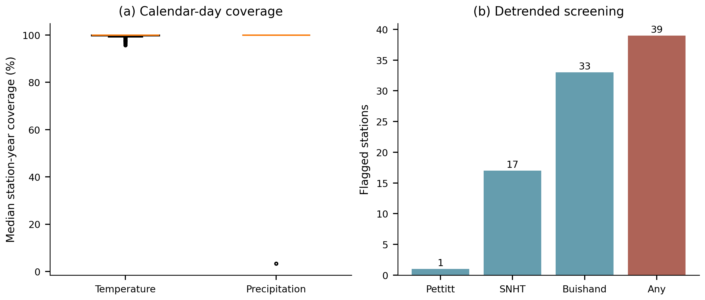
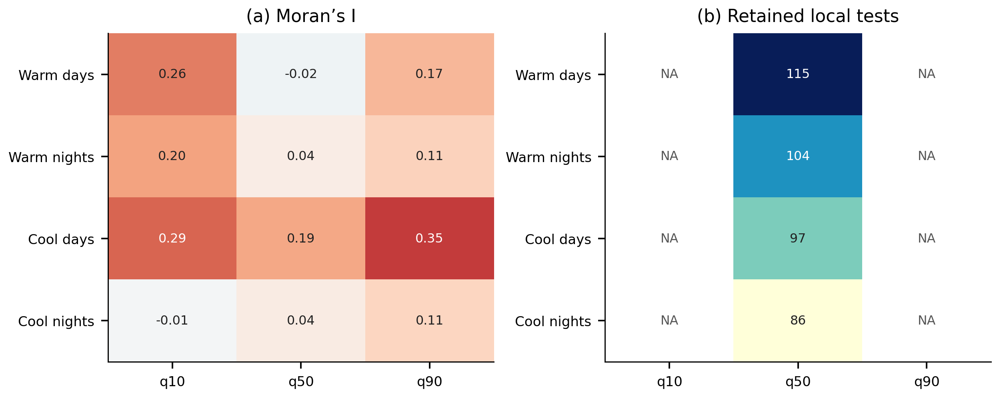
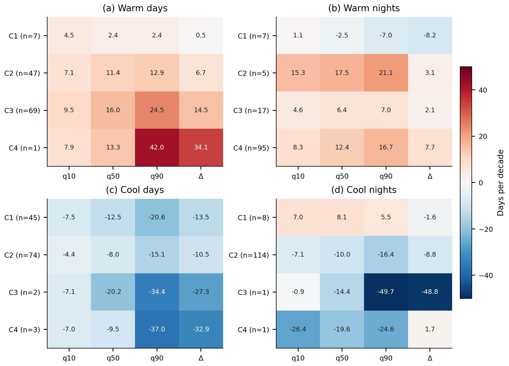
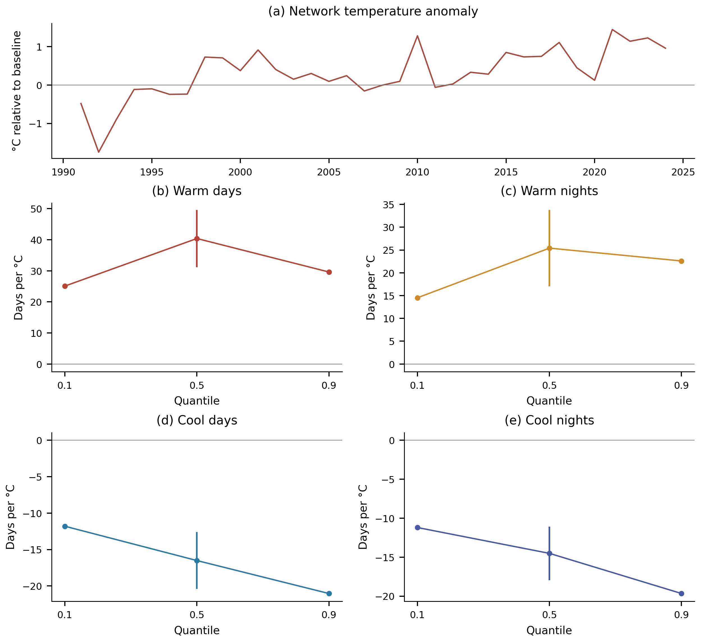
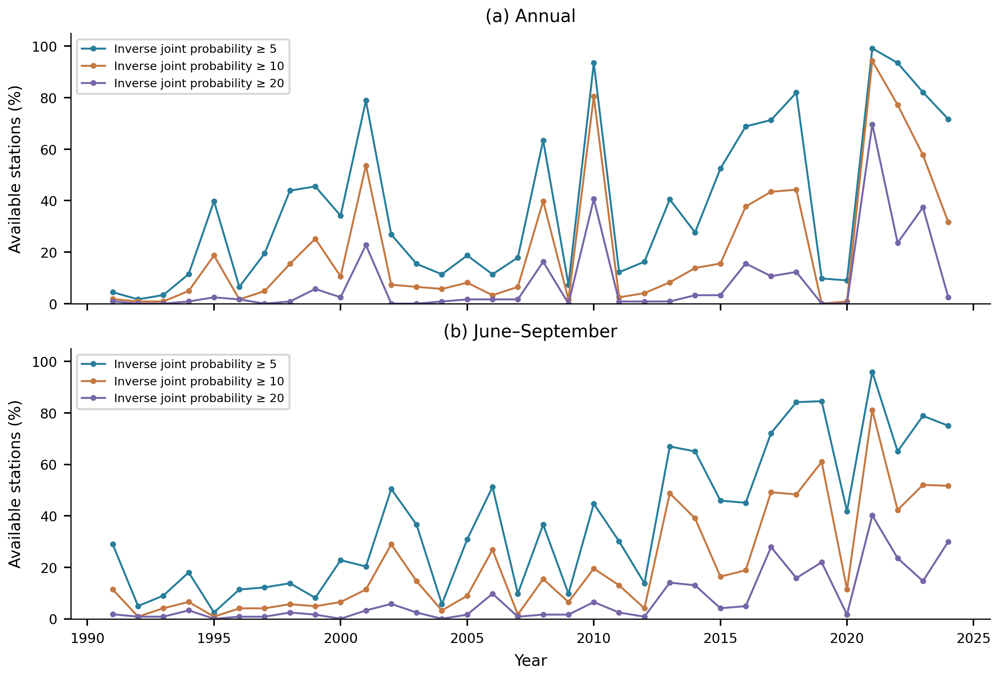

# Supplementary material: thermal extremes and explicit dry–hot concurrence

This supplement accompanies [the revised manuscript](Manuscript_Q1_2026.md). Its figures were selected after an inventory of every existing output and regenerated from machine-readable tables. The [output audit](Output_Audit_2026.md) records verification scope, corrections and removals. The [data catalog](Supplementary_Data_Catalog.md) links retained numerical evidence and explains its role. Original material removed from the active output tree is preserved in a recovery archive identified in the audit.

## S1. Additional methods and interpretation

Thermal slopes concern annual counts and use the historical day-of-year percentile construction described in the main paper. Annual station indices were independently rebuilt from daily observations. All saved 200-replicate thermal bootstrap summaries were recalculated from their individual draws. Alternative 400-replicate and maximum-entropy ensembles are represented by saved station summaries; their summary aggregation was checked, but the alternative draws were not archived and those ensembles were not rerun.

Homogeneity diagnostics use annual mean temperatures, with Pettitt, SNHT and Buishand tests after linear detrending. Their nominal flags do not identify or correct specific artificial breaks. The exclusion sensitivity describes a changed observing network, not a homogenized dataset. Calendar coverage in Figure S1 uses the new screened aggregates; historical available-row completeness is retained in the data catalog and is not substituted for calendar-day coverage.

Spatial diagnostics use five-nearest-neighbor weights and 499 label permutations. The reported Moran probabilities are exploratory across fields. Analytic station probabilities are adjusted within each index–quantile family using Benjamini–Hochberg at 0.05. Tail analytic intervals are unavailable in the archived estimates; NA is retained instead of converting missing tests to zero. The local retained counts do not establish field significance or repair serial-dependence limitations. The precision ratio in Figure S4 is an absolute bootstrap mean divided by bootstrap standard deviation; it must not be interpreted as a time of emergence.

Clustering uses standardized station quantile slopes, average linkage, Euclidean distance and four requested groups per index. Features with absolute correlation at least 0.95 are screened in the configured order. Alternative linkage, distance, k-means and expanded uncertainty-feature choices test sensitivity; adjusted Rand index is used because raw label agreement depends on arbitrary cluster numbering. Cluster composites describe fitted groups, including any singleton clusters, rather than independently validated climate regions. Representatives are observed stations nearest fitted cluster centroids. They illustrate heterogeneity without adding independent inferential evidence.

Geographical regressions and regressions on the internally derived temperature anomaly remain descriptive. The latter share observations and trends with their outcomes. Historical composite “fingerprint” scores combine overlapping diagnostics and their circular-shift null shifts indices independently. They are excluded from the active supplementary evidence because neither the aggregate score nor that null supplies an independent attribution test. Their original files are recorded in the recovery manifest.

Historical empirical joint-rarity analyses use an observation-specific inverse joint probability and available-row completeness. Their yearly networks vary; no stable design return period, fixed marginal AND event, physical affected area or causal “driver” is inferred. Figure S10 preserves this analysis only to demonstrate the effect of event definition.

## S2. Numerical evidence

### Table S1. Primary compound partition with pointwise and family intervals

All entries are percentage points. Pointwise intervals use the 2.5th and 97.5th percentiles of 4,999 synchronized circular-block replicates. Family intervals use the 0.3125th and 99.6875th percentiles for eight primary quantities. Thresholds are re-estimated in each replicate. Nominal multiplicity adjustment does not guarantee exact coverage in short discrete series.

| Period | Component | Estimate | 95% lower | 95% upper | Family lower | Family upper |
| --- | --- | --- | --- | --- | --- | --- |
| Annual | Joint frequency | 20.645 | 9.219 | 40.837 | 5.826 | 47.045 |
| Annual | Dry-frequency term | 8.183 | 4.179 | 18.614 | 3.032 | 22.561 |
| Annual | Hot-frequency term | 12.482 | 6.159 | 23.445 | 4.241 | 26.974 |
| Annual | Excess-joint term | -0.020 | -4.349 | 3.417 | -5.959 | 4.709 |
| June–September | Joint frequency | 12.850 | 7.196 | 27.184 | 5.311 | 32.610 |
| June–September | Dry-frequency term | 2.886 | 0.531 | 10.429 | -0.315 | 12.885 |
| June–September | Hot-frequency term | 9.907 | 5.791 | 16.289 | 4.485 | 18.852 |
| June–September | Excess-joint term | 0.057 | -1.787 | 2.365 | -2.469 | 3.527 |

### Table S2. Joint-frequency sensitivity

Changing coverage, thresholds or station selection changes the estimand. Scenario intervals are exploratory rather than independent confirmations.

| Period | Scenario | N | Estimate | 95% lower | 95% upper |
| --- | --- | --- | --- | --- | --- |
| Annual | primary | 104 | 20.645 | 9.219 | 40.837 |
| June–September | primary | 103 | 12.850 | 7.196 | 27.184 |
| Annual | tails 20 80 | 104 | 17.760 | 5.882 | 35.011 |
| June–September | tails 20 80 | 103 | 10.965 | 5.251 | 23.701 |
| Annual | tails 30 70 | 104 | 20.362 | 8.371 | 42.195 |
| June–September | tails 30 70 | 103 | 14.449 | 7.367 | 29.812 |
| Annual | coverage 90 | 86 | 22.093 | 9.781 | 42.616 |
| June–September | coverage 90 | 101 | 12.930 | 7.338 | 26.791 |
| Annual | block 2 | 104 | 20.645 | 8.710 | 40.218 |
| June–September | block 2 | 103 | 12.850 | 7.539 | 25.985 |
| Annual | block 6 | 104 | 20.645 | 10.068 | 40.781 |
| June–September | block 6 | 103 | 12.850 | 6.796 | 27.473 |
| Annual | fixed threshold uncertainty | 104 | 20.645 | 6.895 | 33.544 |
| June–September | fixed threshold uncertainty | 103 | 12.850 | 6.168 | 19.589 |
| Annual | inclusive ties | 104 | 16.346 | 0.619 | 33.371 |
| June–September | inclusive ties | 103 | 17.362 | 5.540 | 30.097 |
| Annual | positive dry threshold | 104 | 20.645 | 9.219 | 40.837 |
| June–September | positive dry threshold | 75 | 17.647 | 9.725 | 33.804 |
| Annual | common station network | 101 | 20.617 | 8.911 | 41.118 |
| June–September | common station network | 101 | 13.104 | 7.335 | 27.490 |

### Table S3. Daily internal-consistency screening

Screening actions apply to the new compound extension and the explicit historical sensitivity, not retroactively to all historical thermal results.

| Screen | Flagged rows | Stations | Sensitivity action |
| --- | --- | --- | --- |
| tmin greater than tmax | 45 | 32 | set tmin, tmax, and tmean to missing |
| tmean outside valid min max range | 2165 | 61 | set tmean to missing |

### Table S4. Station bootstrap intervals excluding zero

Counts use pointwise 95% percentile intervals, without multiplicity adjustment. They are not equivalent to the analytic FDR counts in Table S5.

| Index | N | q10 | q50 | q90 | Δ |
| --- | --- | --- | --- | --- | --- |
| Warm days | 124 | 47 | 98 | 73 | 9 |
| Warm nights | 124 | 69 | 97 | 88 | 18 |
| Cool days | 124 | 74 | 78 | 57 | 5 |
| Cool nights | 124 | 68 | 73 | 61 | 4 |

### Table S5. Spatial diagnostics and retained local tests

Moran probabilities are nominal permutation results; dependence limitations are described in Section S1. Tail analytic intervals are unavailable: NA denotes no estimable test, not zero significant stations. Bootstrap tail uncertainty is provided separately in Table S4.

| Index | Quantile | N | Moran’s I | Permutation p | FDR retained | Available tests |
| --- | --- | --- | --- | --- | --- | --- |
| Cool days | 0.100 | 124 | 0.290 | 0.002 | NA | 0 |
| Cool nights | 0.100 | 124 | -0.011 | 0.858 | NA | 0 |
| Warm days | 0.100 | 124 | 0.258 | 0.002 | NA | 0 |
| Warm nights | 0.100 | 124 | 0.200 | 0.004 | NA | 0 |
| Cool days | 0.500 | 124 | 0.192 | 0.004 | 97 | 124 |
| Cool nights | 0.500 | 124 | 0.039 | 0.532 | 86 | 124 |
| Warm days | 0.500 | 124 | -0.023 | 0.730 | 115 | 124 |
| Warm nights | 0.500 | 124 | 0.039 | 0.546 | 104 | 124 |
| Cool days | 0.900 | 124 | 0.348 | 0.002 | NA | 0 |
| Cool nights | 0.900 | 124 | 0.108 | 0.058 | NA | 0 |
| Warm days | 0.900 | 124 | 0.166 | 0.008 | NA | 0 |
| Warm nights | 0.900 | 124 | 0.114 | 0.056 | NA | 0 |

### Table S6. Clustering sensitivity: adjusted Rand index

Agreement with the baseline partition. Values near one indicate similar assignments; low agreement cautions against treating the partition as uniquely determined.

| Index | Average / cityblock | Complete / Euclidean | Ward / Euclidean | k-means | Expanded features |
| --- | --- | --- | --- | --- | --- |
| Cool days | 0.447 | 0.458 | 0.409 | 0.356 | 0.065 |
| Cool nights | 1.000 | 0.210 | 0.123 | 0.130 | 0.941 |
| Warm days | 0.979 | 0.689 | 0.845 | 0.626 | 0.153 |
| Warm nights | 0.940 | 0.176 | 0.530 | 0.342 | 0.488 |

### Table S7. Exploratory spatial compactness of clusters

The statistic is mean within-cluster geographical distance, compared with 499 permutations of cluster labels. These nominal probabilities do not validate the fitted groups as physical climate regions.

| Index | Clusters | Observed distance (km) | Permuted distance (km) | Compactness p |
| --- | --- | --- | --- | --- |
| Cool days | 4 | 707.642 | 736.193 | 0.008 |
| Cool nights | 4 | 747.166 | 736.675 | 0.894 |
| Warm days | 4 | 664.927 | 736.843 | 0.002 |
| Warm nights | 4 | 750.505 | 735.851 | 0.882 |

### Table S8. Compound-frequency change in each climate regime

Equal-station within-group means and exploratory 95% synchronized-block intervals; annual and summer sample sizes differ. The complete four-component results are in the linked data catalog.

| Period | Climate regime | N | N₀ | Estimate | 95% lower | 95% upper |
| --- | --- | --- | --- | --- | --- | --- |
| Annual | BWh: hot desert | 28 | 0 | 20.588 | 11.555 | 39.916 |
| Annual | BWk: cold desert | 12 | 0 | 25.000 | 6.863 | 47.549 |
| Annual | BSh: hot steppe | 7 | 0 | 36.134 | 18.487 | 59.664 |
| Annual | BSk: cold steppe | 33 | 0 | 17.112 | 3.565 | 42.602 |
| Annual | C: temperate | 15 | 0 | 16.863 | 6.275 | 35.294 |
| Annual | Dsa: cold, dry summer | 9 | 0 | 22.222 | 5.229 | 53.595 |
| June–September | BWh: hot desert | 26 | 17 | 5.204 | 2.715 | 14.027 |
| June–September | BWk: cold desert | 13 | 2 | 9.502 | 2.692 | 23.529 |
| June–September | BSh: hot steppe | 8 | 5 | 5.882 | 2.206 | 16.912 |
| June–September | BSk: cold steppe | 33 | 3 | 16.221 | 7.130 | 34.225 |
| June–September | C: temperate | 15 | 1 | 20.784 | 6.275 | 44.706 |
| June–September | Dsa: cold, dry summer | 8 | 0 | 21.324 | 10.294 | 45.588 |

## S3. Supplementary figures

### Figure S1. Coverage and homogeneity diagnostics

*Calendar-based valid-day fractions for temperature and precipitation, calculated from the screened aggregates for all available station-years; boxes summarize station medians. Detrended homogeneity flags use nominal p < 0.05 for annual mean temperature; flags are diagnostic, not proof of artificial breaks.*

### Figure S2. Sensitivity of thermal estimates

*(a) Mean station interval-width ratio for 400 versus 200 moving-block replicates. (b) Mean absolute difference between saved moving-block and maximum-entropy bootstrap means. (c) Change in network slopes after internal-consistency screening. (d) Change after excluding homogeneity-flagged stations. Units in (b–d) are days per decade. The two historical alternative bootstrap ensembles were checked through their saved station summaries, not regenerated.*

### Figure S3. Station quantile slopes

*Station estimates at the 0.10, 0.50 and 0.90 quantiles of annual thermal counts, on one common symmetric scale. No interpolation, area weighting or local significance symbols are used. Units are days per decade.*

### Figure S4. Bootstrap precision of median trends

*Absolute bootstrap mean divided by bootstrap standard deviation at the median. This descriptive precision ratio is dimensionless; it is neither an emergence date nor a calibrated detection probability. No threshold-based significance labels are shown.*

### Figure S5. Spatial dependence and multiplicity

*(a) Moran’s I with five-nearest-neighbor weights. (b) Numbers of locally retained tests after Benjamini–Hochberg adjustment separately within each index–quantile family. NA means analytic tail intervals and tests are unavailable, not that zero stations are significant. Historical analytic probabilities are approximate and do not adjust for serial dependence. These counts do not constitute a field-significance test; permutation probabilities are tabulated separately.*

### Figure S6. Exploratory cluster composites

*Median station slopes and upper-minus-lower contrasts within four fitted clusters per index. Cluster labels are specific to each index and have no shared climatic ordering. Cluster separation is partly induced by the fitted features and is not independent validation; single-station groups remain visible through their sample sizes.*

### Figure S7. Exploratory cluster membership

*Station assignments from standardized, screened quantile-slope features and average-linkage Euclidean clustering. Colors distinguish categories only within each panel; clusters are not fixed climate regions. Alternative-method agreement and within-cluster sample sizes are reported in the supplementary tables.*

### Figure S8. Representative station profiles

*One observed station per index-specific cluster, selected by the archived nearest-centroid rule. Lines show the full 0.10–0.90 quantile profile. These selected illustrations are not additional independent discoveries; all station coefficients and bootstrap intervals are available in the data catalog.*

### Figure S9. Association with the network temperature anomaly

*(a) Internally derived annual network temperature anomaly relative to 1991–2007. (b–e) Fixed-baseline network thermal-count response coefficients at three quantiles, with available median pointwise analytic intervals, in days per degree Celsius. Tail analytic intervals are unavailable and must not be inferred from the unadorned points. The predictor and outcomes share observations and temporal trends; the associations do not attribute change to external forcing.*

### Figure S10. Historical joint-rarity sensitivity

*Percentage of the available station network exceeding three empirical inverse-joint-probability cutoffs. Labels denote within-record rarity classes, not stable design return periods. This historical calculation uses unscreened daily data, available-row coverage denominators and a varying station network. It is retained as a definition sensitivity and is distinct from the main paper’s fixed marginal AND event.*

### Figure S11. Geographical associations of thermal asymmetry

*Standardized multiple-regression coefficients relating the upper-minus-lower slope contrast to latitude, longitude and elevation. These are descriptive associations; no causal driver attribution or spatially adjusted significance is implied.*

## S4. Reproducibility and complete machine-readable evidence

All retained research tables are indexed in [Supplementary_Data_Catalog.md](Supplementary_Data_Catalog.md), including station-level results, complete bootstrap draws, reference metadata and validation records. Main and supplementary graphics are available as vector PDF, editable SVG, 350-dpi PNG and 600-dpi TIFF. The [supplementary figure atlas](../outputs/publication_v2/Supplementary_Figure_Atlas.pdf) contains Figures S1–S11; the [main atlas](../outputs/publication_v2/Figure_Atlas.pdf) contains Figures 1–10. Map boundaries supply geographical context only; their external source and redistribution license still require author confirmation.

Build the extension with `python run_publication.py`, validate raw-derived thermal and compound quantities with `python validate_publication.py`, and build the curated supplementary graphics with `python build_supplementary.py`. Rebuild text and atlases with `python build_publication_docs.py`. The wider historical numerical audit is reproduced with `python audit_output_data.py recompute`; it writes to an isolated work directory and never overwrites research outputs. Cleanup follows a file-specific manifest, with a verified recovery archive before deletion.
