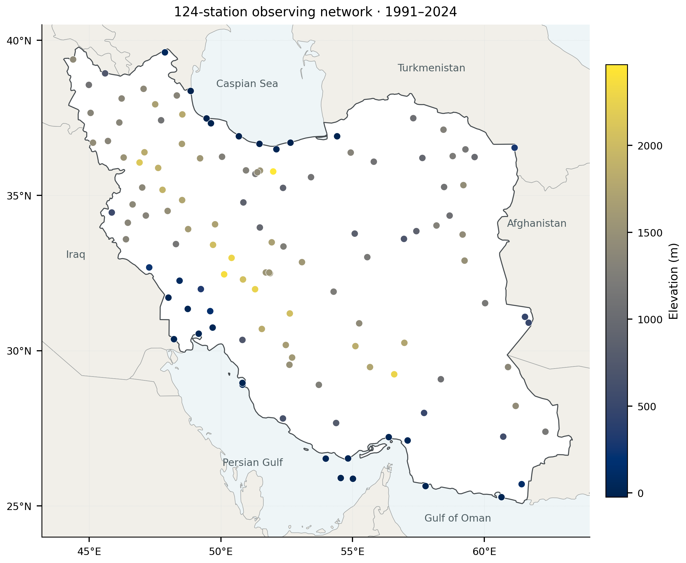
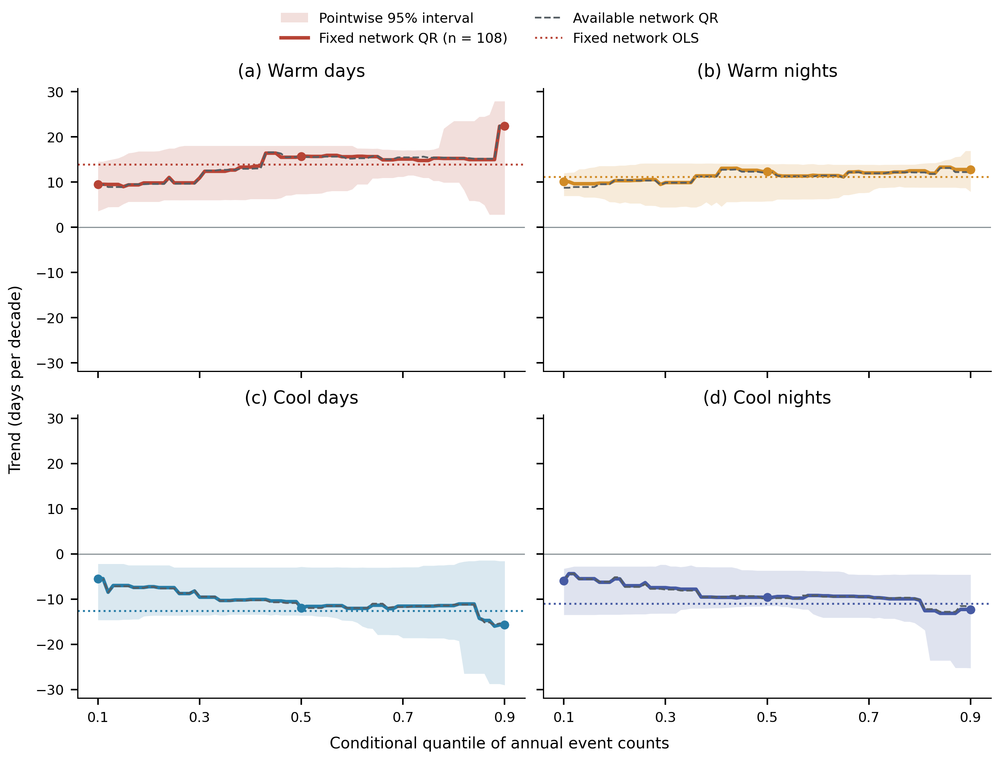
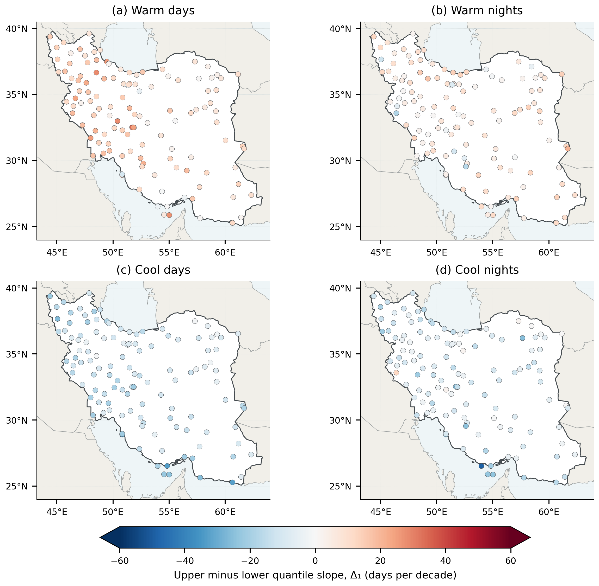
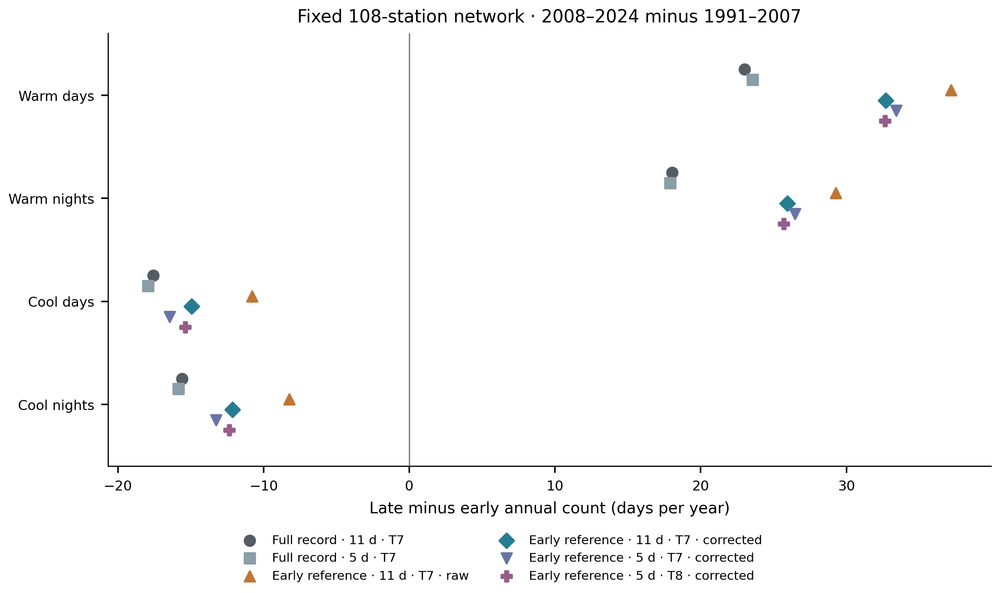
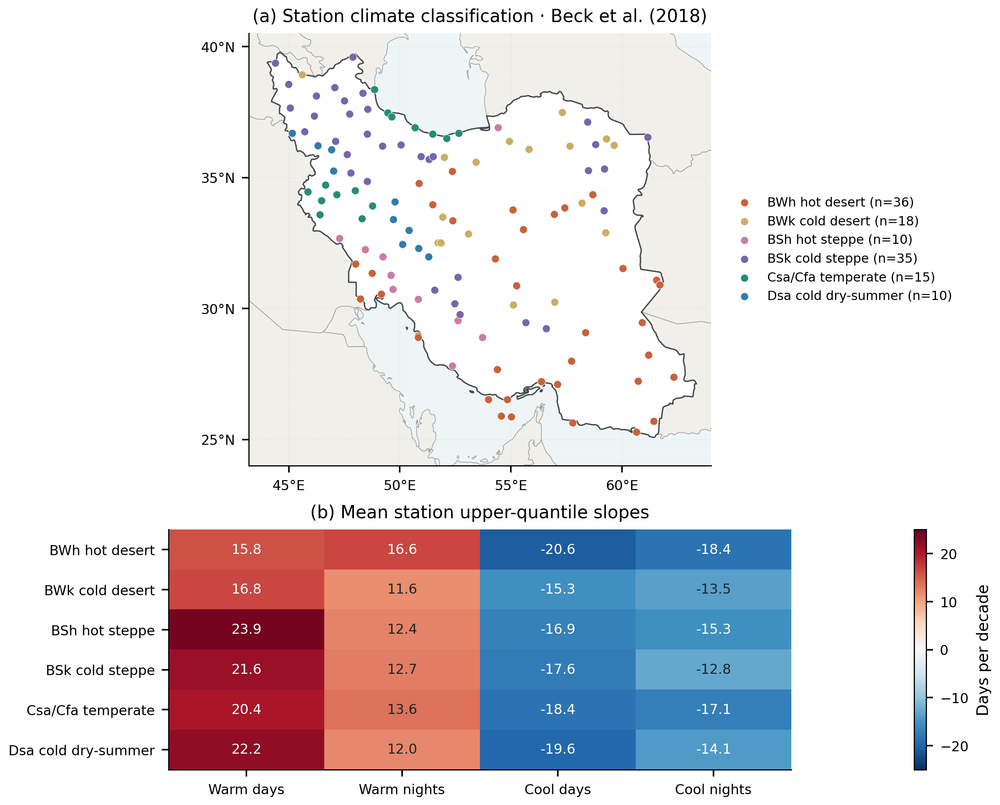
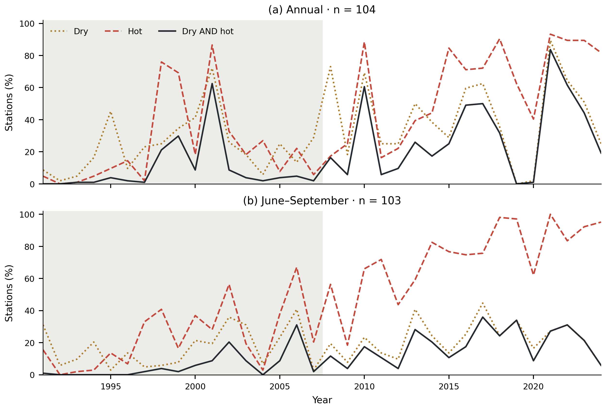
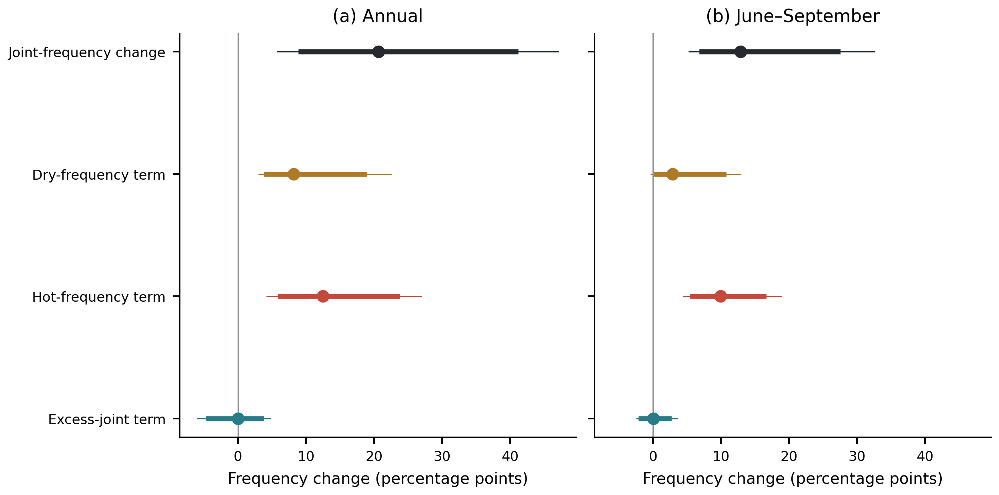
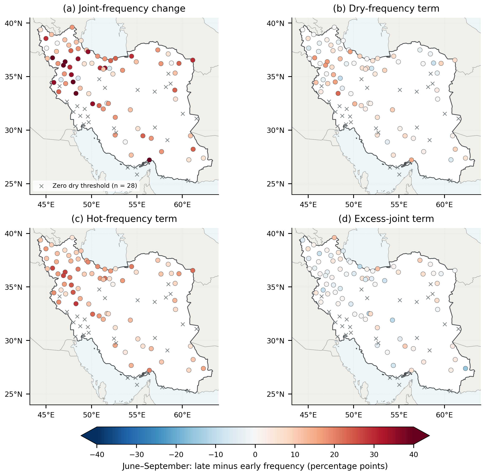
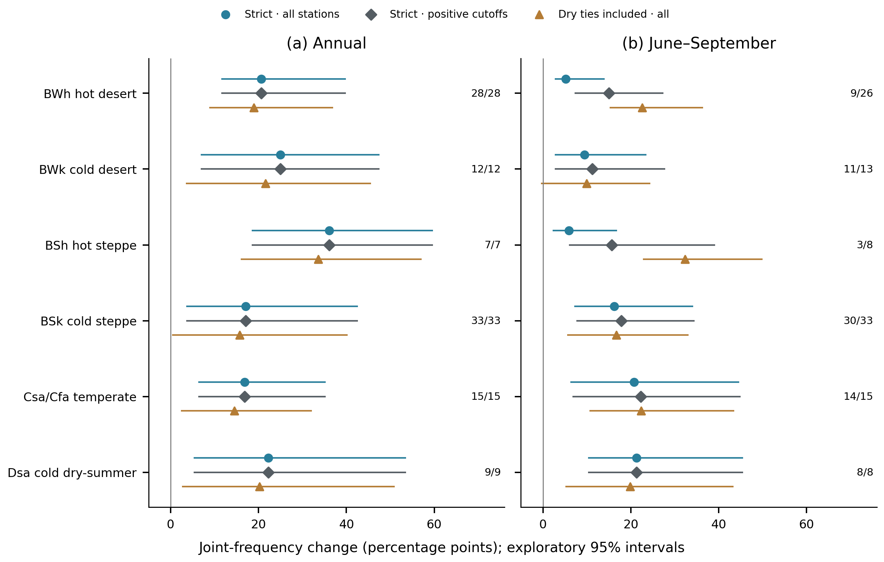
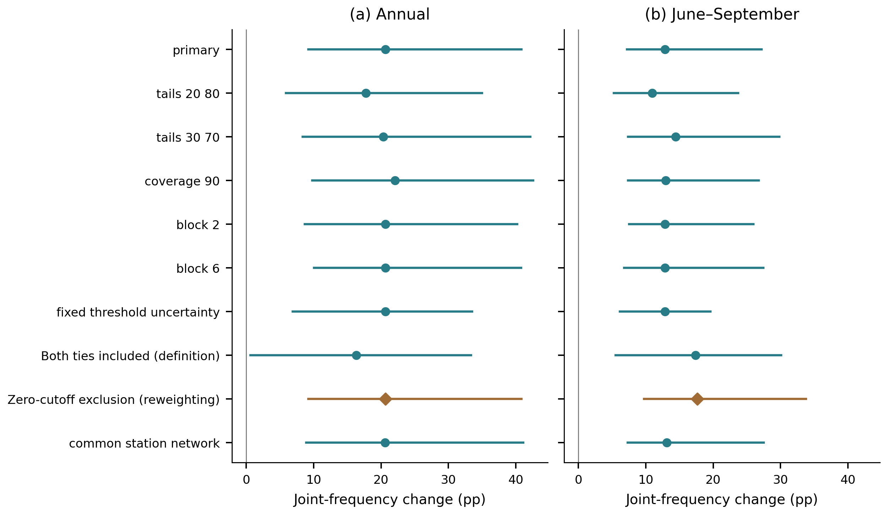

# Distributional thermal change and the components of increasing dry–hot concurrence across Iran, 1991–2024

**Running title:** Thermal extremes and dry–hot concurrence in Iran

**Article type:** Research Article

**Authors:** [Author names, affiliation superscripts, and corresponding-author asterisk]

**Affiliations:** [Department, institution, city, postal code, and country for each affiliation]

**Author email addresses:** [Email address for each author]

*Correspondence: [Corresponding author], [postal address]. Email: [email]. ORCID: [ORCID].

## Abstract

Changes in thermal extremes and compound dry–hot occurrence depend on both climate behavior and event construction. We analyzed daily observations from 124 Iranian stations during 1991–2024, using a fixed 108-station network for annual thermal-count quantile trends. Six controlled index constructions evaluated reference period, percentile window, quantile convention and in-base estimation correction. A complementary analysis classified dry–hot years using 1991–2007 precipitation and temperature quartiles and partitioned joint-frequency change into dry-frequency, hot-frequency and excess-joint components. Warm-day point slopes ranged from 9.52 to 22.37 days decade⁻¹ across the 0.10–0.90 quantiles, but their contrast had a 95% interval of −5.76 to 19.66; thermal asymmetry and day–night differences remained unresolved. In-base correction reduced fixed-reference warm-day/warm-night increases from 37.17/29.26 to 32.71/25.94 days per year on identical stations. All evaluated constructions retained warming-consistent period-change directions. Annual dry–hot frequency increased from 9.16% to 29.81% on 104 balanced stations; June–September frequency increased from 5.54% to 18.39% on 103 stations. The summer increase of 12.85 percentage points partitioned into 2.89 from dry-frequency change, 9.91 from hot-frequency change and 0.06 from excess joint occurrence. Synchronized year-block intervals supported increased concurrence but did not resolve an excess-joint change. Excluding 28 zero-cutoff summer stations simply rescales the point change to 17.65 and provides no independent robustness evidence. Matched-station tie comparisons substantially altered climate-regime patterns. The findings separate directional change from unresolved asymmetry and definition-driven contrasts; inference remains conditional on short reference samples, observed stations and unhomogenized daily records.

**Keywords:** thermal change; dry–hot concurrence; quantile regression; compound events; block bootstrap; Iran

## 1. Introduction

Climate change can alter both the center and shape of a temperature distribution, so a mean trend alone does not describe the behavior of extremes (Katz and Brown, 1992). Counts of warm and cool days are useful observational indicators (Alexander et al., 2006; Zhang et al., 2011; Dunn et al., 2020), and regional station studies show widespread warming-consistent changes even where precipitation responses are less spatially coherent (Donat et al., 2014). Annual count distributions may nevertheless change unevenly, requiring an explicit distributional estimand rather than an assumption that the whole distribution follows its mean.

Quantile regression provides that distinction by estimating conditional trends across the response distribution (Koenker and Bassett, 1978; Koenker, 2005). Barbosa et al. (2011) combined quantile trends, bootstrap uncertainty, and clustering for European temperatures, while Fan (2014) examined quantile-dependent annual temperature-extreme counts in China. These studies establish the methodological precedent for the present thermal analysis. Our question concerns the regional expression of those distributional changes and their relationship to a separately defined compound hydroclimatic signal.

Concurrent low precipitation and high temperature create a second interpretive challenge. Their joint frequency depends on the frequencies of the individual conditions and on their concurrence. Greater joint occurrence can therefore accompany more frequent heat without requiring stronger dependence between temperature and precipitation (Zscheischler and Seneviratne, 2017). Observed and projected increases in the spatial extent of dry–hot events reinforce the importance of this distinction (Wu et al., 2021). Alizadeh et al. (2020), Bevacqua et al. (2022), and Schmutz et al. (2026) further show why event composition, precipitation change, sampling uncertainty, and dependence must be separated.

Event definition matters when applying that question to a short observational record. An observation may have a small empirical joint survival probability because one variable is unusual, even when the other is not beyond a marginal extreme threshold. A joint-rarity classification and an explicit low-precipitation/high-temperature AND classification consequently describe different sets of years. In arid environments, the distinction is complicated further by zero precipitation and tied observations. Transparent definitions are necessary before changes in joint frequency can be interpreted as changes in concurrent dryness and heat.

Iran provides a heterogeneous setting for evaluating these distinctions. Its station network spans Caspian lowlands, the Alborz and Zagros mountains, interior plateaus, deserts, and southern coasts. Iranian and wider Middle Eastern station studies have reported increasing warm and decreasing cool extremes (Zhang et al., 2005a; Rahimzadeh et al., 2009; Soltani et al., 2016), while adjustment of non-climatic discontinuities can alter individual trends (Rahimzadeh and Nassaji Zavareh, 2014). Ghasemi (2026) applied quantile regression to Iranian temperatures, and Jamali et al. (2026) examined station climate-classification changes. Quantile analysis and climatic regionalization therefore already have direct Iranian precedents.

The unresolved empirical question is whether distributionally uneven thermal-count changes coexist with increasing explicit dry–hot concurrence in these Iranian observations, and how the interpretation depends on marginal frequencies and zero precipitation across climate settings. The studies compared in Table S15 establish the individual approaches, but do not answer this combined question for the same station network. Recent probability decompositions (Zhao and Xiong, 2026) reinforce the need to state the added observational evidence precisely.

We address three objectives: quantify distributional thermal change and its climate-regime contrasts across the 124-station network; determine whether explicit fixed-baseline dry–hot concurrence increased on stable observing networks; and partition the period difference into changes associated with marginal event frequencies and excess joint occurrence, both nationally and within climate regimes. The contribution has three parts. First, fixed-network annual-count quantile profiles and paired contrast intervals distinguish supported thermal directions from unresolved distributional asymmetry, and permit qualified comparison with count-based precedents. Second, a station-first partition with synchronized resampling and threshold re-estimation quantifies the components of observed concurrence while accounting for a short reference sample. Third, fixed climate groups expose where zero precipitation makes a relative dry-event definition structurally restrictive. We assess sensitivity to screening, thresholds, coverage, block length and precipitation ties. These analyses provide complementary evidence; they do not estimate a causal or predictive relationship between a station's thermal quantile trend and its compound-frequency change.

## 2. Data and methods

### 2.1. Observations, coverage, and quality diagnostics

Daily minimum, maximum, and mean temperature and precipitation observations from 124 Iranian stations during 1991–2024 were provided by the Iran Meteorological Organization (IRIMO) (Fig. 1). Station coordinates and elevation were obtained from the accompanying metadata.

*Figure 1. Locations of the 124 stations in the 1991–2024 data set. Color denotes station elevation. Coordinates are displayed in WGS84 longitude and latitude with latitude-adjusted aspect. Boundaries provide geographical context; symbols represent individual observations rather than a spatially continuous sample. Primary network thermal trends use the common 108-station subset in Section 2.3; compound analyses use the balanced subsets described in Section 2.4.*

The data set contains 1,539,956 station-days without duplicate dates; median variable completeness ranges from 98.94% to 99.42%. Checks found 45 records at 32 stations with minimum temperature above maximum and a further 2,165 records at 61 stations with mean temperature outside that interval. Primary thermal estimates use the supplied observations, with a separate sensitivity analysis that excludes inconsistent records. The compound analysis treats all temperatures as missing for the first conflict and mean temperature as missing for the second; negative precipitation is also treated as missing.

Pettitt, standard normal homogeneity, and Buishand-type tests applied to annual mean temperature flagged 119 raw and 39 detrended station series under at least one diagnostic (Pettitt, 1979; Buishand, 1982; Alexandersson, 1986). These screens do not constitute daily homogenization. We examined sensitivity to excluding the 39 detrended series because station histories and reference-network information were insufficient to support automatic adjustments.

### 2.2. Annual thermal indices and baseline sensitivity

Day-of-year 10th- and 90th-percentile thresholds were estimated from the 1991–2024 record using an 11-day circular window, comprising each calendar day and five days on either side. Leap days were omitted. When a local reference sample contained fewer than 15 observations, the station-wide reference sample was used. Warm days and nights are strict exceedances of the upper maximum- and minimum-temperature thresholds; cool days and nights are strict departures below the corresponding lower thresholds. Annual values are counts of observed qualifying days, set to missing below 80% valid coverage. Primary counts are not annualized to compensate for missing days, so residual coverage differences remain a limitation. A separate 365-day-equivalent sensitivity assesses this issue (Section 2.3).

We evaluated six controlled constructions on the same common 108-station network, keeping the temperature observations, calendar, station selection, and annual coverage unchanged (Table S12). The primary full-record construction uses the 1991–2024 reference period, an 11-day window, and linearly interpolated Hyndman–Fan type-7 quantiles. Type 7 assigns plotting positions $p_k=(k-1)/(n-1)$, whereas the median-unbiased type-8 convention uses $p_k=(k-1/3)/(n+1/3)$; both interpolate between adjacent ordered observations. A 5-day full-reference variant isolates window width. For the fixed 1991–2007 reference, we compare the uncorrected 11-day/type-7 series with corrected 11-day/type-7, corrected 5-day/type-7, and corrected 5-day/type-8 series. This sequence separates the effects of reference period, in-base estimation, window width, and quantile convention.

Following Zhang et al. (2005b), each baseline target year is excluded and replaced in turn by a second copy of each other baseline year. Target-year counts are calculated under all 16 resulting threshold sets and averaged, so corrected counts can be fractional. Years 2008–2024 retain thresholds from the original 17-year reference. All donor windows met the 15-observation minimum.

We compare late-minus-early station mean counts and valid-day percentages, then average the differences with equal station weights. The common network and identical masks isolate construction effects from membership and observation opportunity. The 5-day/type-8 correction follows percentile conventions used for climate-extreme indices, but the 17-year reference and annual 80% coverage rule differ from standard baseline and monthly-completeness conventions; these are therefore not described as fully standard ETCCDI indices (Zhang et al., 2011). The replacement corrects a specific in-base/out-of-base mismatch; it neither homogenizes observations nor eliminates uncertainty from a short, trending baseline. Reference-period choice can strongly affect percentile-index trends in 30–40-year studies (Yosef et al., 2021). The correction is distinct from uncertainty resampling, whose intervals condition on each completed index series.

### 2.3. Quantile trends and spatial summaries

For annual count \(Y\) and time \(t\), measured in decades, we fitted

$$Q_Y(\tau\mid t)=\beta_0(\tau)+\beta_1(\tau)t.$$

The quantile coefficient minimizes the sum of check losses \(\rho_\tau(u)=u[\tau-\mathbf{1}(u<0)]\). Primary profiles were fitted at quantiles 0.10–0.90 in steps of 0.01, with 0.10, 0.50, and 0.90 as focal summaries. Construction sensitivities refit those three focal quantiles and OLS. Ordinary least squares (OLS) provides a mean-trend comparison. We distinguish regression of the annual network-mean series from averaging individual-station regression coefficients; these operations generally yield different values. The asymmetry metric is

$$\Delta_1=\hat\beta_1(0.90)-\hat\beta_1(0.10).$$

It describes differences in slopes across annual count quantiles, not a change in daily temperature intensity. For declining cool indices, a negative value denotes a more negative slope at the upper count quantile.

The primary network series is the equal-station mean on the intersection of stations with nonmissing annual counts for all four indices in every year: 108 stations over 34 years. Each index separately has 109 complete stations, but those sets differ. This common subset holds membership constant across time and between day and night. We compare it with the annually available network (115–124 stations for daytime and 114–124 for nighttime indices) and each index-specific fixed set. A further diagnostic uses 365 times each common station's observed count divided by its valid-day count, before network averaging. This 365-day-equivalent series assumes missing days are representative within a station-year; it is a coverage sensitivity, not imputation or a substitute for the observed-count estimand.

Network uncertainty uses 4,999 circular moving-block pairs replicates of the 34 annual observations, with four-year blocks and two- and six-year sensitivities (Künsch, 1989; Fitzenberger, 1998). Each sampled pair retains its original calendar-year covariate together with the full response field. The same sampled year positions are used across all four indices and compared networks, preserving their observed within-year dependence; stations are not resampled independently. Intercept-and-time quantile fits minimize the weighted check loss over observation-pair line intersections. For nonunique optima, the midpoint of the extreme optimal slopes is used. The optimization results were verified independently by linear programming. Daily percentile thresholds and selected station sets are held fixed; these conditional intervals do not include threshold-estimation or network-selection uncertainty. Block resampling in a short trending record provides approximate inference, without a finite-sample coverage guarantee.

We calculate every slope contrast within its paired replicate: \(\Delta_{1,i}^{*}=\beta_{1,i}^{*}(0.90)-\beta_{1,i}^{*}(0.10)\), and \(C_{w}^{*}=\Delta_{1,\mathrm{warm\ days}}^{*}-\Delta_{1,\mathrm{warm\ nights}}^{*}\), with an analogous signed cool-index contrast. Thus, contrast intervals account for covariance between fitted slopes and indices. The cool contrast compares signed asymmetries, not their absolute magnitudes. Table 1 reports pointwise 95% percentile intervals for OLS, focal quantiles and \(\Delta_1\); Figure 2 shows pointwise bands across the quantile grid, not a simultaneous band. Table S10 additionally reports nominal Bonferroni intervals using quantiles 0.004167 and 0.995833 for six primary contrasts: four \(\Delta_1\) values and the two day-minus-night contrasts. This six-contrast family is separate from the eight compound quantities in Section 2.6. We also omit each year in turn to assess point-estimate sensitivity.

Station-level moving-block and maximum-entropy bootstraps, FDR screening, Moran diagnostics, and clustering sensitivities are detailed in the Supporting Information (Künsch, 1989; Vinod, 2006; Benjamini and Hochberg, 1995). They are exploratory and distinct from primary fixed-network inference. Station maps show observed estimates without interpolation.

### 2.4. Explicit dry–hot events on a balanced network

The compound analysis uses annual precipitation totals with annual mean temperature, and June–September precipitation totals with the seasonal mean of daily maximum temperature. Coverage is computed against the number of calendar days, including missing daily rows, separately for precipitation and temperature. A year requires at least 80% coverage for both variables. To keep the comparison independent of changes in station membership, a station must meet these conditions in all 34 years; this yields 104 annual and 103 warm-season stations. Precipitation totals are not scaled for missing days. A 90% coverage sensitivity tests the influence of this choice, without assuming that missing precipitation is zero.

For station \(s\), define dry and hot indicators

$$D_{sy}=\mathbf{1}(P_{sy}<q^{P}_{s,0.25}),\qquad H_{sy}=\mathbf{1}(T_{sy}>q^{T}_{s,0.75}),\qquad J_{sy}=D_{sy}H_{sy},$$

where both thresholds use the 17 baseline years, 1991–2007, with linearly interpolated sample quantiles. Quartiles provide a less sparse primary classification than more extreme cutoffs in this short baseline; these events are relative dry–hot conditions, not rare design hazards. Fixed thresholds are applied to both periods. Period frequencies are first calculated at each station and then averaged with equal station weights. Annual network extent is the percentage of those same stations with \(J=1\).

Strict inequalities prevent equality to a tied threshold from automatically qualifying as an extreme. In particular, a zero lower precipitation threshold permits no strictly drier year. We retain these stations in the primary network summary but report their number and examine both inclusive inequalities and exclusion of zero-threshold stations. Additional sensitivities use 20th/80th and 30th/70th percentiles, stricter coverage, and the intersection of annual and warm-season station sets.

To separate sample composition from event definition, stations in each balanced network are classified by whether their observed baseline precipitation quartile is zero or positive, and these strata remain fixed in resampling. With strict inequalities and nonnegative precipitation, every zero-cutoff station has zero dry and joint frequency. Thus, for each network or climate group,

$$\widehat{\Delta j}_{\mathrm{all}}=\frac{N_+}{N}\widehat{\Delta j}_{+},$$

where \(N_+\) is the positive-cutoff count. The identity also holds for every partition component; exclusion therefore changes the population and denominator rather than supplying independent robustness evidence.

Three matched rules separate equality effects: strict \(P<q_{25},T>q_{75}\), dry-inclusive \(P\leq q_{25},T>q_{75}\), and both-inclusive \(P\leq q_{25},T\geq q_{75}\). Shared draws isolate dry- and hot-equality effects within climate and zero/positive-cutoff strata. Including zero at a zero precipitation cutoff changes the meaning of “dry.” Fixed-threshold strict draws retain the dilution identity; threshold refitting can make an originally zero cutoff positive, so its interval cannot be rescaled mechanically.

### 2.5. Exact partition of the joint-frequency difference

Let \(d_k\), \(h_k\), and \(j_k\) denote a station's dry, hot, and joint frequencies in period \(k\), with \(k=0\) for 1991–2007 and \(k=1\) for 2008–2024. Write \(c_k=j_k-d_kh_k\), the excess joint frequency relative to the product of the two marginal frequencies. The exact identity

$$j_1-j_0=\underbrace{(d_1-d_0)\frac{h_1+h_0}{2}}_{A_D}+\underbrace{(h_1-h_0)\frac{d_1+d_0}{2}}_{A_H}+\underbrace{(c_1-c_0)}_{A_C}$$

allocates the change in the marginal-frequency product symmetrically between dry and hot frequencies. The three terms sum exactly to the joint-frequency difference at every station and in their equally weighted network mean. Multiplication by 100 expresses the terms in percentage points.

This is an accounting identity, not a causal model. In particular, \(c\) is covariance between binary threshold indicators; its change does not isolate copula change. Indicator covariance may vary with marginal frequencies even under an unchanged copula. We therefore call \(A_C\) the *excess-joint term*, and interpret \(A_D\) and \(A_H\) as frequency components rather than fractions of externally forced change.

### 2.6. Resampling and multiplicity

For the partition, we generated 4,999 circular moving-block bootstrap replicates separately within each 17-year period. Four-year blocks were sampled with replacement and truncated to the original period length. Within each period, the same sampled years were used for every station and both variables, retaining observed within-year spatial and cross-variable dependence. The two periods were resampled independently. Baseline thresholds were re-estimated in every replicate before evaluating both period samples, so the intervals include variation in the estimated thresholds. A conditional-threshold sensitivity holds the original cutoffs fixed; two- and six-year blocks assess the resampling choice.

We report 95% percentile intervals and wider, nominal Bonferroni intervals using quantiles 0.003125 and 0.996875 for eight primary quantities: four partition terms under two event definitions. These are approximate intervals from short, discretized samples, not exact simultaneous coverage guarantees. Numerical resampling choices assess interval sensitivity; threshold and station-set changes assess different estimands. Neither category supplies independent replication, and zero-cutoff exclusion is identified separately as algebraic reweighting at the point-estimate level. No local significance symbols are placed on the new station maps. Resampling assumes that blocks represent variability within each period and does not model secular nonstationarity inside the periods or dependence across their boundary.

Station membership, coverage calculations, quantile fits, probability and dilution identities, slope contrasts, and interval calculations were checked independently. The Supporting Information describes the scope of these verification checks.

### 2.7. Climate classification and stratified analysis

We assigned station coordinates to the 1-km present-climate Köppen–Geiger classification of Beck et al. (2018), representing 1980–2016. The six reporting groups are BWh hot desert (36 stations), BWk cold desert (18), BSh hot steppe (10), BSk cold steppe (35), temperate Csa/Cfa (15), and Dsa cold dry-summer (10). The temperate group combines 13 Csa and two Cfa stations for reporting; this aggregation does not imply climatic equivalence. One station was assigned from the nearest valid grid cell because its coordinate intersected a missing value. These are fixed climate labels, not an analysis of climate-type transitions. The 2018 classification was retained as a prespecified stratification; the newer classification of Beck et al. (2023) provides a possible basis for future sensitivity analysis.

For each group we summarized station thermal slopes and fixed-baseline changes. A 999-label permutation test compared the maximum-minus-minimum group mean across 32 prespecified index–metric combinations with FDR control. Spatial dependence limits exchangeability, so these omnibus results are supporting diagnostics rather than pairwise tests.

For the compound analysis, climate groups are intersected with the balanced annual or summer station set. We calculate group means of each probability-partition term and obtain exploratory 95% within-group intervals from the same synchronized 4,999 bootstrap fields used for the network analysis. Group-specific replication therefore preserves cross-station and cross-group covariance. These intervals are not multiplicity-adjusted between-regime tests, and their overlap or separation is not used to declare one climate regime more affected than another. Counts of zero dry thresholds are reported alongside the summer results.

## 3. Results

### 3.1. Fixed-network thermal trends and unresolved asymmetry

On the common 108-station network, warm-count slopes were positive and cool-count slopes negative at all three focal quantiles, with primary pointwise 95% intervals excluding zero (Fig. 2; Table 1). Warm-day point slopes were 9.52, 15.72 and 22.37 days decade⁻¹ at q10, q50 and q90; corresponding warm-night slopes were 10.07, 12.34 and 12.78. Cool-day estimates ranged from −5.45 at q10 to −15.70 at q90, and cool-night estimates from −5.91 to −12.27. These coefficients support a warming-consistent direction within the fixed observing network, conditional on the index construction and resampling assumptions.

*Figure 2. Quantile slopes of annual mean counts on the common 108-station network (solid colored lines), with pointwise 95% percentile bands from 4,999 synchronized circular year-pairs block replicates of length four. Colored dotted lines show fixed-network OLS slopes; gray dashed curves show the annually available network for comparison. Points identify q10, q50 and q90. Shading quantifies uncertainty in the network slope, not between-station spread or simultaneous coverage across quantiles. The response is an annual count, not daily temperature intensity. Contrast uncertainty is calculated from paired replicates and reported separately in Table 1 and Table S10.*

**Table 1. Thermal trends and paired upper-minus-lower contrasts on the common 108-station network.**

<!-- THERMAL_NETWORK_TABLE -->
| Index | OLS [95% interval] | q10 [95% interval] | q50 [95% interval] | q90 [95% interval] | Δ₁ [95% interval] |
| --- | --- | --- | --- | --- | --- |
| Warm days | 13.95 [8.64, 17.08] | 9.52 [3.56, 14.55] | 15.72 [7.34, 18.04] | 22.37 [2.81, 27.90] | 12.85 [-5.76, 19.66] |
| Warm nights | 11.14 [8.09, 12.92] | 10.07 [6.94, 11.97] | 12.34 [5.76, 14.03] | 12.78 [7.87, 16.91] | 2.71 [-2.24, 7.00] |
| Cool days | -12.61 [-18.39, -4.55] | -5.45 [-14.62, -2.18] | -11.95 [-13.62, -2.83] | -15.70 [-29.00, -1.56] | -10.24 [-22.23, 3.28] |
| Cool nights | -10.97 [-15.73, -4.55] | -5.91 [-13.47, -3.24] | -9.60 [-11.50, -3.67] | -12.27 [-25.24, -4.57] | -6.37 [-19.30, 3.11] |
<!-- END_THERMAL_NETWORK_TABLE -->

*All coefficients and intervals are in days decade⁻¹. Brackets contain pointwise 95% intervals from 4,999 synchronized four-year block replicates. Δ₁ = q90 slope − q10 slope, calculated before rounding within each replicate. The four Δ₁ intervals include zero; the wider six-contrast family intervals are provided in Table S10. Station-level FDR screening is a different estimand and appears in Table S5.*

The apparent quantile ordering was not resolved as a nonzero network asymmetry. Warm-day Δ₁ was 12.85 [−5.76, 19.66] days decade⁻¹, compared with 2.71 [−2.24, 7.00] for warm nights; cool-day and cool-night values were −10.24 [−22.23, 3.28] and −6.37 [−19.30, 3.11]. The paired warm-day minus warm-night asymmetry was 10.14 [−5.99, 14.24], and the signed cool-day minus cool-night contrast was −3.88 [−8.05, 5.09] days decade⁻¹. All six pointwise and family intervals included zero (Table S10). The evidence therefore supports directional thermal change more strongly than unequal quantile slopes or a day–night difference in asymmetry; inclusion of zero does not establish equality.

Changing network definition had little effect relative to interval widths (Table S9; Fig. S12), and the coverage-equivalent diagnostic retained all contrast signs. Two- and six-year blocks left all six asymmetry contrasts unresolved (Fig. S13). Leave-one-year-out warm-day Δ₁ ranged from 2.32 to 13.39 days decade⁻¹ (Table S11), showing magnitude sensitivity despite stable point-estimate signs.

### 3.2. Spatial heterogeneity and index-construction sensitivity

Station asymmetry maps use the full 124-station data set and show substantial variation in point-estimate magnitude (Fig. 3); their station-level estimand differs from the fixed-network regressions in Section 3.1. Positive warm-day Δ₁ occurred at 118 stations and negative cool-day Δ₁ at all 124. The maps show individual-station values; they do not imply a continuous trend surface. Exploratory Moran diagnostics gave the most consistent spatial organization for cool-day slopes, while clustering was sensitive enough to remain a supplementary description.

*Figure 3. Station-specific Δ₁ for the four annual thermal indices. All panels use the same zero-centered color scale in days decade⁻¹. Positive values indicate a larger upper-quantile slope; negative values indicate a more negative upper-quantile slope. Colors encode point estimates without local significance claims or spatial interpolation.*

Index construction affected the magnitude of fixed-reference period changes while preserving their warming-consistent directions (Fig. 4; Tables S12–S13). On the same 108 stations, uncorrected 11-day/type-7 thresholds gave +37.17 warm days and +29.26 warm nights per year in 2008–2024 relative to 1991–2007. In-base correction reduced these differences to +32.71 and +25.94: reductions of 4.46 and 3.32 days per year. Cool-day and cool-night differences became more negative, from −10.78/−8.24 to −14.93/−12.13. The correction changes the baseline counts while leaving the late-period counts unchanged. Earlier 124-station uncorrected estimates of +36.78/+28.41 concern a different population and are not used to quantify the correction effect.

Using corrected 5-day/type-7 thresholds gave +33.43/+26.46 warm days/nights per year; switching that construction to type 8 gave +32.64/+25.71. Valid-day percentages retained the same directions: corrected 11-day/type-7 differences were +8.95, +6.97, −4.15 and −3.55 percentage points for warm days, warm nights, cool days and cool nights. A full-record reference gave different count changes (+23.00/+18.04 for the primary 11-day construction), underscoring that reference climate is part of the estimand. These comparisons use identical stations and daily observation masks; they are not independent observations of the signal.

*Figure 4. Equal-station mean annual-count differences between 2008–2024 and 1991–2007 on the same 108 stations under six index constructions. Full record denotes the 1991–2024 reference and early reference denotes 1991–2007; 5 d and 11 d are total calendar-day window widths. T7 and T8 denote linear and median-unbiased sample quantiles. Corrected variants average in-base target-year counts over 16 donor-year replacements; out-of-base thresholds are unchanged. Symbols are sensitivity point estimates, not independent replications or confidence intervals. Table S13 also reports changes in percentages of valid days and conditional trend uncertainty.*

The unresolved-asymmetry conclusion was also retained: every Δ₁ sensitivity interval included zero (Fig. S14). For example, corrected 11-day/type-7 warm-day Δ₁ was 10.29 [−10.11, 22.69] days decade⁻¹, compared with 12.85 [−5.76, 19.66] for the primary full-record construction. Thus, the stable directional count change does not establish a precise invariant magnitude or a detected distributional asymmetry. Supplementary Figures S1–S8 present the quality, spatial, and clustering diagnostics.

Available-network diagnostics were also directionally stable (Fig. S2). Excluding 39 detrended homogeneity flags changed Δ₁ by at most 1.29 days decade⁻¹, and masking inconsistent temperatures changed focal slopes by at most 0.026. These descriptive checks do not replace the primary fixed-network contrast intervals.

### 3.3. Climate regimes organize the spatial contrasts

All six climate groups had positive mean upper-quantile warm-day and warm-night slopes and negative mean cool-day and cool-night slopes (Fig. 5; Table 2). In the full-reference station estimates, the strongest mean upper-quantile warm-day trends occurred in BSh hot steppe (23.85 days decade⁻¹) and Dsa cold dry-summer settings (22.23), whereas BWh hot desert had a smaller warm-day slope (15.84) but the largest warm-night slope (16.64). Thus, the descriptive network-wide daytime point contrast did not describe every climate setting: hot-desert stations exhibited comparatively strong nighttime change.

*Figure 5. (a) Station membership in six fixed Köppen–Geiger reporting groups, using the Beck et al. (2018) 1980–2016 climate raster. The 15-station temperate group pools Csa and Cfa for reporting. (b) Group means of station-specific 0.90-quantile slopes for annual thermal-event counts, with a common zero-centered scale. These are descriptive means, not slopes fitted to group-average series, classification-change estimates, or proof of between-group significance.*

**Table 2. Climate-regime composition and mean station upper-quantile thermal slopes.**

<!-- REGIME_THERMAL_TABLE -->
| Regime | N | Mean elevation (m) | Warm days | Warm nights | Cool days | Cool nights |
| --- | --- | --- | --- | --- | --- | --- |
| BWh hot desert | 36 | 575.05 | 15.84 | 16.64 | -20.59 | -18.36 |
| BWk cold desert | 18 | 1401.71 | 16.75 | 11.62 | -15.28 | -13.48 |
| BSh hot steppe | 10 | 495.39 | 23.85 | 12.36 | -16.85 | -15.34 |
| BSk cold steppe | 35 | 1442.13 | 21.62 | 12.72 | -17.56 | -12.82 |
| Csa/Cfa temperate | 15 | 671.57 | 20.44 | 13.64 | -18.37 | -17.09 |
| Dsa cold dry-summer | 10 | 1917.11 | 22.23 | 11.99 | -19.62 | -14.09 |
<!-- END_REGIME_THERMAL_TABLE -->

*Elevation is the group mean in meters; all four slopes are in days decade⁻¹. Station counts refer to the complete thermal network. Compound analyses use smaller balanced subsets (Table 4). These summaries do not identify the climatic cause of a trend.*

BWh stations also had the most negative mean upper-quantile cool-day slope (−20.59 days decade⁻¹), compared with −15.28 in BWk cold desert. These contrasts describe the data but are less decisive inferentially: no time-trend or fixed-baseline regime statistic survived FDR across the prespecified 32-metric family. The two retained statistics (q = 0.048 each) concerned thermal-index responses to the regional temperature anomaly, not trends per decade. Consequently, the climate classification improves geographical interpretation without establishing six statistically distinct trend populations.

### 3.4. Explicit dry–hot concurrence increased on stable station sets

With both marginal thresholds required, annual dry–hot frequency increased from 9.16% to 29.81% between periods, a change of 20.64 percentage points across 104 stations (95% interval 9.22–40.84). June–September frequency increased from 5.54% to 18.39%, or 12.85 percentage points across 103 stations (7.20–27.18; Fig. 6). The wider primary-family intervals also remained above zero. These frequencies describe equal-weight station networks, not percentages of Iranian land area.

*Figure 6. Percentage of balanced-network stations classified as dry, hot, or simultaneously dry AND hot in each year. Annual and June–September definitions use separate station sets and their own fixed 1991–2007 precipitation and temperature quartiles. Shading identifies the baseline period. Strict inequalities are used; joint-event extent cannot exceed either marginal extent. Counts are based on screened daily observations and calendar-day coverage.*

Summer dryness classification was constrained by precipitation zeros: 28 of the 103 stations had a baseline lower quartile of zero. Such stations cannot satisfy the strict dry inequality and contribute zero joint frequency in the primary classification. No annual station had a zero lower quartile. Sensitivities changing the tie convention and station inclusion are therefore necessary for interpreting the seasonal difference; the primary annual and summer magnitudes should not be read as a controlled comparison of identical event populations.

### 3.5. The hot-frequency term accounts for most of the summer point change

The exact partition attributes the summer point difference to +2.89 percentage points in the dry-frequency term, +9.91 in the hot-frequency term, and +0.06 in the excess-joint term (Fig. 7; Table 3). The corresponding annual components were +8.18, +12.48, and −0.02 percentage points. These components sum to the observed joint changes before rounding. The hot-frequency term had the larger point estimate under both definitions, but the overlapping component intervals do not by themselves constitute a paired test that it exceeds the dry-frequency term.

*Figure 7. Partition of the late-minus-early joint-frequency difference. Points are equal-station estimates; thick intervals are 95% percentile intervals and thin intervals are nominal Bonferroni intervals across eight primary quantities. The 4,999 synchronized circular year-block replicates re-estimate baseline thresholds. The three colored component estimates sum exactly to the total change. The excess-joint term is a covariance difference between binary indicators, not a causal or copula-isolated contribution.*

**Table 3. Compound-frequency differences and partition terms, in percentage points.**

| Definition | Stations | Joint change [95% interval] | Dry-frequency term [95% interval] | Hot-frequency term [95% interval] | Excess-joint term [95% interval] |
| --- | ---: | --- | --- | --- | --- |
| Annual | 104 | 20.64 [9.22, 40.84] | 8.18 [4.18, 18.61] | 12.48 [6.16, 23.44] | −0.02 [−4.35, 3.42] |
| June–September | 103 | 12.85 [7.20, 27.18] | 2.89 [0.53, 10.43] | 9.91 [5.79, 16.29] | 0.06 [−1.79, 2.37] |

*Intervals include baseline-threshold re-estimation and synchronized resampling within each period. The wider nominal primary-family intervals are shown in Fig. 7. In particular, the summer dry-frequency term does not exclude zero under that wider interval. No component is interpreted as a physical attribution fraction.*

The excess-joint intervals included zero under both definitions, providing no resolved network-wide change in this term. This differs from claiming that temperature and precipitation are independent, or that their dependence structure is unchanged. Station components varied spatially (Fig. 8), while the network average could conceal compensating local patterns. These short station records do not justify local significance claims from inspection of the mapped colors.

*Figure 8. June–September station estimates of the joint-frequency difference and its three partition terms for the 103-station balanced network. All panels share a symmetric color scale in percentage points. Gray crosses identify the 28 stations with zero baseline precipitation thresholds, which cannot satisfy the strict dry definition; their zero-valued contributions are retained in network means. Colored circles show the remaining station estimates without interpolation or significance symbols.*

### 3.6. Compound-frequency changes within climate regimes

The annual joint-frequency point difference was positive in every climate group, ranging from 16.86 percentage points in the temperate group to 36.13 in BSh hot steppe (Fig. 9). Summer point differences ranged from 5.20 in BWh hot desert to 21.32 in Dsa cold dry-summer settings; the temperate and BSk cold-steppe groups had changes of 20.78 and 16.22 percentage points, respectively (Table 4). These patterns extend the climate-regime interpretation from individual thermal indices to explicit compound concurrence.

*Figure 9. Climate-regime joint-frequency changes under strict rules on the full balanced station sets, strict rules on the observed-positive-cutoff subset, and dry-inclusive rules on the full station sets. The hot condition remains strict in all three displayed comparisons. Numbers give positive-cutoff/all station counts. Points and exploratory 95% intervals use synchronized four-year blocks with threshold refitting; observed strata remain fixed. The larger positive-subset point estimate is algebraic reweighting, not independent robustness evidence. Within-group intervals are not tests comparing climate groups. Both-inclusive results and paired rule effects are in Table S14 and Fig. S15.*

**Table 4. Summer compound-frequency change and its components by climate regime.**

<!-- REGIME_COMPOUND_TABLE -->
| Regime | N | N₀ | Joint change [95% interval] | Dry-frequency term | Hot-frequency term | Excess-joint term |
| --- | --- | --- | --- | --- | --- | --- |
| BWh hot desert | 26 | 17 | 5.20 [2.71, 14.03] | 1.87 | 3.85 | -0.52 |
| BWk cold desert | 13 | 2 | 9.50 [2.69, 23.53] | 1.06 | 8.54 | -0.11 |
| BSh hot steppe | 8 | 5 | 5.88 [2.21, 16.91] | 1.08 | 5.06 | -0.26 |
| BSk cold steppe | 33 | 3 | 16.22 [7.13, 34.22] | 2.78 | 12.46 | 0.99 |
| Csa/Cfa temperate | 15 | 1 | 20.78 [6.27, 44.71] | 6.32 | 14.74 | -0.28 |
| Dsa cold dry-summer | 8 | 0 | 21.32 [10.29, 45.59] | 4.95 | 17.06 | -0.69 |
<!-- END_REGIME_COMPOUND_TABLE -->

*All changes and components are percentage points. N₀ denotes stations with zero baseline precipitation quartiles. The joint-change interval is an exploratory 95% within-group interval. Component point estimates sum to the joint change before rounding; complete intervals for every component and both seasons are in the supplementary tables.*

The hot-frequency point term exceeded the dry-frequency term in all six summer groups, while every excess-joint interval included zero. Lower hot-arid estimates partly reflect zero dry thresholds at 17/26 BWh and 5/8 BSh stations, versus 0/8 Dsa stations. Removing these structural zeros raises strict-rule changes from 5.20 to 15.03 points for BWh and from 5.88 to 15.69 for BSh solely through the denominator. On the original sets, including dry ties gives 22.62, 32.35, and 19.85 points for BWh, BSh, and Dsa (Fig. 9; Table S14). This definition-driven reordering, small groups, and broad intervals preclude hazard ranking.

### 3.7. Numerical sensitivity, structural-zero dilution and tie effects

All scenarios retained positive joint-frequency point changes (Fig. 10), but change the estimand or uncertainty model rather than providing independent replication. Alternative percentile cutoffs yielded annual changes of 17.76–20.36 and summer changes of 10.97–14.45 points; 90% coverage gave 22.09 and 12.93. Holding thresholds fixed narrowed the summer interval to 6.17–19.59, versus 7.20–27.18 with refitting. Block length changed interval endpoints but not observed point estimates.

The 28 summer zero-cutoff stations contribute exactly zero under observed strict thresholds: 12.849800 = (75/103) × 17.647059. Their exclusion therefore supplies no additional robustness evidence, and the identity holds for every component and fixed-threshold replicate (Table S14). Under threshold refitting, some resampled cutoffs become positive, so the full-network interval cannot be obtained by scaling the positive-subset interval.

On identical stations, including precipitation equality changed the summer estimate from 12.85 to 19.65 points; additionally including temperature equality changed it to 17.36. The paired dry-equality effect was +6.80 [3.03, 9.82], and the hot-equality point effect was −2.28 (Fig. S15). These are exploratory definition effects: equality at zero reclassifies zero-precipitation seasons rather than identifying below-zero dryness. Discrete percentile intervals are therefore conditional diagnostics (Table S14).

*Figure 10. Joint-frequency changes and exploratory 95% synchronized-block intervals under ten scenarios. Block length and threshold refitting assess numerical uncertainty; threshold, tie and coverage/network choices change the estimand. Zero-cutoff exclusion, marked by a diamond, is algebraic reweighting of the observed strict point estimate and supplies no independent robustness evidence. Its refitted-threshold interval is not a scaled copy of the full-network interval. The both-inclusive scenario changes both precipitation and temperature equality; their separate paired effects are shown in Fig. S15.*

## 4. Discussion

### 4.1. Thermal changes in relation to earlier observational studies

Quantile regression can expose differences between high- and low-count years that OLS or median trends conceal (Barbosa et al., 2011; Fan, 2014), but those differences require direct uncertainty tests. Fan's Chinese warm-night slopes increased from 4.63 at q10 to 8.83 days decade⁻¹ at q90; ours increased from 10.07 to 12.78, but the q90–q10 interval included zero. Fan reported cool-day q10/q90 slopes of +0.19/+0.07, whereas ours were −5.45/−15.70. Thus, declining Iranian cool-day counts occur at both tails, but unequal tail slopes remain unresolved. Different periods, references, station weights, and homogenization prevent formal claims of regional sensitivity or acceleration (Table S15).

The warming-consistent direction agrees with earlier Iranian station analyses (Rahimzadeh et al., 2009; Soltani et al., 2016), while the large change after in-base correction confirms that construction matters. Rahimzadeh and Nassaji Zavareh (2014) further showed why unhomogenized records constrain trend interpretation. Ghasemi's (2026) monthly temperature quantiles measure intensity rather than annual exceedance counts, and recent model projections of increasing Iranian warm extremes address future rather than observed change (Najafi et al., 2025). The present contribution is therefore the linked count-distribution, concurrence-partition, and climate-stratified evidence, not the first application of quantile analysis or extreme indices in Iran (Table S15).

The unresolved day–night contrast does not identify mechanisms involving radiation, moisture, boundary-layer processes, or circulation, none of which was observed directly. Counts also omit heatwave duration and intensity. Likewise, the compound increase is conditional on relative quartiles and monitoring locations: it is neither an absolute heat-stress threshold nor a soil-moisture drought or impact measure.

### 4.2. More joint events do not require a resolved excess-joint increase

The summer partition shows that more frequent hot seasons can substantially increase dry–hot occurrence without a resolved increase beyond the marginal product, consistent with compound-event theory (Zscheischler and Seneviratne, 2017). The binary accounting is narrower than copula or distribution-parameter decompositions (Schmutz et al., 2026; Zhao and Xiong, 2026): it neither isolates dependence change nor attributes physical causation.

The positive annual dry-frequency term precludes a general claim that precipitation is unimportant; precipitation change and internal variability can be central to hot–dry occurrence (Bevacqua et al., 2022). The smaller summer dry term also reflects frequent zero totals at the lower threshold, so time scale and definition matter.

Increasing occurrence is qualitatively consistent with global and US evidence (Wu et al., 2021; Alizadeh et al., 2020), but their grids, long records, seasons, and event definitions are not numerically interchangeable with this 34-year station analysis. The present record cannot estimate rare return periods or separate recent change from all multidecadal variability. Its added result is uncertainty on explicit station-frequency components and on the precipitation-tie constraint in arid groups.

### 4.3. What climate classification adds to the interpretation

Köppen–Geiger groups expose information hidden by a national mean: sample size, zero thresholds, and relative joint changes can be viewed together. Smaller strict-rule BWh and BSh averages partly reflect structural-zero dilution, while larger temperate and Dsa values are departures from local baselines rather than greater absolute aridity. Inclusive rules can reverse the ordering, an accounting effect rather than evidence of a different physical response.

Unlike Jamali et al.'s (2026) time-varying classifications, our Beck et al. (2018) labels are fixed; the maps cannot establish boundary transitions or attribute components to aridification. Updated classes could support future sensitivity analysis (Beck et al., 2023). No thermal time-trend regime comparison survived FDR, and the compound-event intervals are within-group summaries, not adjusted between-group tests. Sparse groups and spatial dependence therefore support heterogeneous descriptive estimates, not distinct climatic response populations.

### 4.4. Uncertainty and spatial interpretation

Fixed membership removes network turnover but not nonrandom missing days or unequal spatial representation. Paired year-field resampling targets the slope contrasts while synchronized compound blocks preserve observed spatial and cross-variable coherence; threshold refitting acknowledges only 17 baseline observations. All asymmetry intervals include zero, and point ordering cannot establish stronger daytime asymmetry.

Four-year blocks provide few effective units; within-period trends challenge stationarity, and Bonferroni adjustment cannot correct short-record coverage. An unresolved excess-joint change is therefore absence of clear evidence, not proof of stable dependence. Equal-station summaries describe the monitoring network, not Iranian land area; dense clusters receive more weight and opposing local components can cancel. Area-weighted products and explicit spatial models are required for physical affected-area or formal regional inference.

### 4.5. Specific contribution, transferability, and next steps

The comparisons in Table S15 identify the empirical contribution: a cool-day tail pattern different from Fan's Chinese result, increased concurrence without a resolved excess-joint increase, and climate-specific zero-threshold constraints. These findings distinguish conclusions supported by the observations from those dependent on event construction. The contribution rests on these results and their explicit uncertainty, not on combining established methods alone.

The transferable procedure is to retain a stable network, calculate station-first probabilities, partition their difference with synchronized uncertainty, and report zero-threshold prevalence. This separates increased occurrence from altered concurrence in other arid archives. Linking thermal asymmetry to compound change remains a separate hypothesis requiring matched stations and control of shared trends and spatial dependence.

Inference remains limited by absent metadata-supported homogenization, nonrandom missing precipitation, a 17-year baseline, and coverage-based station exclusion. FDR does not resolve all temporal and spatial dependence, and in-base correction does not make the reference independent. The extensions quantify conditional slope uncertainty and distinguish construction, dilution, and tie effects without removing those limitations.

Longer homogenized records, gridded area-weighted products, and soil-moisture or evaporative-demand observations would add independent evidence. Copula counterfactuals, heatwave duration, and simultaneous day–night persistence would address dependence and persistence questions that the present annual-frequency estimands cannot.

## 5. Conclusions

Across the common 108-station network, thermal-count trends were warming-consistent: warm-day slopes ranged from 9.52 to 22.37 days decade⁻¹ and warm-night slopes from 10.07 to 12.78. Yet all four q90–q10 intervals and both paired day–night intervals included zero; neither distributional nor stronger daytime asymmetry was resolved. In-base correction reduced matched fixed-reference warm-day/warm-night increases from 37.17/29.26 to 32.71/25.94 days per year, showing construction-dependent magnitude despite stable direction.

Annual dry–hot frequency rose from 9.16% to 29.81%, and June–September frequency from 5.54% to 18.39%. The 12.85-point summer increase [7.20, 27.18] partitioned into 9.91 hot-frequency, 2.89 dry-frequency, and 0.06 excess-joint points; the last interval included zero. Thus, increased occurrence does not establish strengthened dependence, while the positive annual dry term precludes dismissing precipitation. All climate groups had positive point changes, but group contrasts remain exploratory and locally relative. Excluding 28 zero-cutoff summer stations only rescales the strict estimate, whereas matched tie rules materially change the event. Conclusions remain conditional on the 34-year unhomogenized station record, short baseline, missingness, and unequal spatial sampling. Longer homogenized records, independent spatial products, and process observations are needed to test mechanisms and regional contrasts.

## Acknowledgements

The authors thank the Iran Meteorological Organization for providing the station observations used in this study.

## Conflict of interest

[Conflict-of-interest statement]

## Funding

[Funding statement]

## Author contributions

[Author-by-author CRediT contribution statement]

## Data availability statement

Daily station observations were provided by the Iran Meteorological Organization and remain subject to its access and redistribution policies. Requests for access should be directed to the Iran Meteorological Organization.

## Supporting information

The Supporting Information contains additional methods, complete component and sensitivity intervals, station-network diagnostics, controlled index-construction analyses, structural-zero and tie analyses, fifteen supporting figures, and fifteen supporting tables. Table S15 gives the detailed comparison with prior studies cited in the Discussion.

## References

Alexander LV, Zhang X, Peterson TC, Caesar J, Gleason B, Klein Tank AMG, Haylock M, Collins D, Trewin B, Rahimzadeh F, Tagipour A, Rupa Kumar K, Revadekar J, Griffiths G, Vincent L, Stephenson DB, Burn J, Aguilar E, Brunet M, Taylor M, New M, Zhai P, Rusticucci M, Vazquez-Aguirre JL (2006). Global observed changes in daily climate extremes of temperature and precipitation. *Journal of Geophysical Research: Atmospheres* 111:D05109. https://doi.org/10.1029/2005JD006290

Alexandersson H (1986). A homogeneity test applied to precipitation data. *Journal of Climatology* 6:661–675. https://doi.org/10.1002/joc.3370060607

Alizadeh MR, Adamowski J, Nikoo MR, AghaKouchak A, Dennison P, Sadegh M (2020). A century of observations reveals increasing likelihood of continental-scale compound dry-hot extremes. *Science Advances* 6:eaaz4571. https://doi.org/10.1126/sciadv.aaz4571

Barbosa SM, Scotto MG, Alonso AM (2011). Summarising changes in air temperature over Central Europe by quantile regression and clustering. *Natural Hazards and Earth System Sciences* 11:3227–3233. https://doi.org/10.5194/nhess-11-3227-2011

Beck HE, McVicar TR, Vergopolan N, Berg A, Lutsko NJ, Dufour A, Zeng Z, Jiang X, van Dijk AIJM, Miralles DG (2023). High-resolution (1 km) Köppen-Geiger maps for 1901–2099 based on constrained CMIP6 projections. *Scientific Data* 10:724. https://doi.org/10.1038/s41597-023-02549-6

Beck HE, Zimmermann NE, McVicar TR, Vergopolan N, Berg A, Wood EF (2018). Present and future Köppen–Geiger climate classification maps at 1-km resolution. *Scientific Data* 5:180214. https://doi.org/10.1038/sdata.2018.214

Benjamini Y, Hochberg Y (1995). Controlling the false discovery rate: a practical and powerful approach to multiple testing. *Journal of the Royal Statistical Society: Series B* 57:289–300. https://doi.org/10.1111/j.2517-6161.1995.tb02031.x

Bevacqua E, Zappa G, Lehner F, Zscheischler J (2022). Precipitation trends determine future occurrences of compound hot–dry events. *Nature Climate Change* 12:350–355. https://doi.org/10.1038/s41558-022-01309-5

Buishand TA (1982). Some methods for testing the homogeneity of rainfall records. *Journal of Hydrology* 58:11–27. https://doi.org/10.1016/0022-1694(82)90066-X

Donat MG, Peterson TC, Brunet M, King AD, Almazroui M, Kolli RK, Boucherf D, Al-Mulla AY, Nour AY, Aly AA, Nada TAA, Semawi MM, Al Dashti HA, Salhab TG, El Fadli KI, Muftah MK, Dah Eida S, Badi W, Driouech F, El Rhaz K, Abubaker MJY, Ghulam AS, Erayah AS, Mansour MB, Alabdouli WO, Al Dhanhani JS, Al Shekaili MN (2014). Changes in extreme temperature and precipitation in the Arab region: long-term trends and variability related to ENSO and NAO. *International Journal of Climatology* 34:581–592. https://doi.org/10.1002/joc.3707

Dunn RJH, Alexander LV, Donat MG, Zhang X, Bador M, Herold N, Lippmann T, Allan R, Aguilar E, Barry AA, Brunet M, Caesar J, Chagnaud G, Cheng V, Cinco T, Durre I, de Guzman R, Htay TM, Wan Ibadullah WM, Bin Ibrahim MKI, Khoshkam M, Kruger A, Kubota H, Leng TW, Lim G, Li‐Sha L, Marengo J, Mbatha S, McGree S, Menne M, de los Milagros Skansi M, Ngwenya S, Nkrumah F, Oonariya C, Pabon‐Caicedo JD, Panthou G, Pham C, Rahimzadeh F, Ramos A, Salgado E, Salinger J, Sané Y, Sopaheluwakan A, Srivastava A, Sun Y, Timbal B, Trachow N, Trewin B, van der Schrier G, Vazquez‐Aguirre J, Vasquez R, Villarroel C, Vincent L, Vischel T, Vose R, Bin Hj Yussof MN (2020). Development of an updated global land in situ-based dataset of temperature and precipitation extremes: HadEX3. *Journal of Geophysical Research: Atmospheres* 125:e2019JD032263. https://doi.org/10.1029/2019JD032263

Fan LJ (2014). Quantile trends in temperature extremes in China. *Atmospheric and Oceanic Science Letters* 7:304–308. https://doi.org/10.3878/j.issn.1674-2834.13.0102

Fitzenberger B (1998). The moving blocks bootstrap and robust inference for linear least squares and quantile regressions. *Journal of Econometrics* 82:235–287. https://doi.org/10.1016/S0304-4076(97)00058-4

Ghasemi AR (2026). Analyzing spatiotemporal patterns of extreme temperatures in Iran using principal component analysis and quantile regression. *Earth and Space Science* 13:e2025EA004860. https://doi.org/10.1029/2025EA004860

Jamali M, Eslamian S, Shayannejad M, Gohari A (2026). Observed warming–driven aridification and climate-type transitions across Iran. *Journal of Arid Environments* 235:105606. https://doi.org/10.1016/j.jaridenv.2026.105606

Katz RW, Brown BG (1992). Extreme events in a changing climate: variability is more important than averages. *Climatic Change* 21:289–302. https://doi.org/10.1007/BF00139728

Koenker R (2005). *Quantile Regression*. Cambridge University Press, Cambridge. https://doi.org/10.1017/CBO9780511754098

Koenker R, Bassett G Jr (1978). Regression quantiles. *Econometrica* 46:33–50. https://doi.org/10.2307/1913643

Künsch HR (1989). The jackknife and the bootstrap for general stationary observations. *The Annals of Statistics* 17:1217–1241. https://doi.org/10.1214/aos/1176347265

Najafi MR, Abbasian M, Na W, RahimiMovaghar M, Bakhtiari S, Islam MR, Fereshtehpour M, Jalili Pirani F, Rezvani R (2025). Multi-model projection of climate extremes under 1.5°C–4°C global warming levels across Iran. *International Journal of Climatology* 45:e8740. https://doi.org/10.1002/joc.8740

Pettitt AN (1979). A non-parametric approach to the change-point problem. *Applied Statistics* 28:126–135. https://doi.org/10.2307/2346729

Rahimzadeh F, Asgari A, Fattahi E (2009). Variability of extreme temperature and precipitation in Iran during recent decades. *International Journal of Climatology* 29:329–343. https://doi.org/10.1002/joc.1739

Rahimzadeh F, Nassaji Zavareh M (2014). Effects of adjustment for non-climatic discontinuities on determination of temperature trends and variability over Iran. *International Journal of Climatology* 34:2079–2096. https://doi.org/10.1002/joc.3823

Schmutz J, Vrac M, François B, Bulut B (2026). Spatial structures of emerging hot and dry compound events over Europe from 1950 to 2023. *Natural Hazards and Earth System Sciences* 26:881–900. https://doi.org/10.5194/nhess-26-881-2026

Soltani M, Laux P, Kunstmann H, Stan K, Sohrabi MM, Molanejad M, Sabziparvar AA, Ranjbar SaadatAbadi A, Ranjbar F, Rousta I, Zawar-Reza P, Khoshakhlagh F, Soltanzadeh I, Babu CA, Azizi GH, Martin MV (2016). Assessment of climate variations in temperature and precipitation extreme events over Iran. *Theoretical and Applied Climatology* 126:775–795. https://doi.org/10.1007/s00704-015-1609-5

Vinod HD (2006). Maximum entropy ensembles for time series inference in economics. *Journal of Asian Economics* 17:955–978. https://doi.org/10.1016/j.asieco.2006.09.001

Wu X, Hao Z, Tang Q, Singh VP, Zhang X, Hao F (2021). Projected increase in compound dry and hot events over global land areas. *International Journal of Climatology* 41:393–403. https://doi.org/10.1002/joc.6626

Yosef Y, Aguilar E, Alpert P (2021). Is it possible to fit extreme climate change indices together seamlessly in the era of accelerated warming? *International Journal of Climatology* 41(S1):E952–E963. https://doi.org/10.1002/joc.6740

Zhang X, Aguilar E, Sensoy S, Melkonyan H, Tagiyeva U, Ahmed N, Kutaladze N, Rahimzadeh F, Taghipour A, Hantosh TH, Albert P, Semawi M, Karam Ali M, Al-Shabibi MHS, Al-Oulan Z, Zatari T, Al Dean Khelet I, Hamoud S, Sagir R, Demircan M, Eken M, Adiguzel M, Alexander LV, Peterson TC, Wallis T (2005a). Trends in Middle East climate extreme indices from 1950 to 2003. *Journal of Geophysical Research: Atmospheres* 110:D22104. https://doi.org/10.1029/2005JD006181

Zhang X, Alexander L, Hegerl GC, Jones P, Klein Tank AMG, Peterson TC, Trewin B, Zwiers FW (2011). Indices for monitoring changes in extremes based on daily temperature and precipitation data. *WIREs Climate Change* 2:851–870. https://doi.org/10.1002/wcc.147

Zhang X, Hegerl G, Zwiers FW, Kenyon J (2005b). Avoiding inhomogeneity in percentile-based indices of temperature extremes. *Journal of Climate* 18:1641–1651. https://doi.org/10.1175/JCLI3366.1

Zhao T, Xiong S (2026). How Do Precipitation Changes Affect Compound Dry and Hot Events Amidst Global Warming? *International Journal of Climatology* 46:e70324. https://doi.org/10.1002/joc.70324

Zscheischler J, Seneviratne SI (2017). Dependence of drivers affects risks associated with compound events. *Science Advances* 3:e1700263. https://doi.org/10.1126/sciadv.1700263
