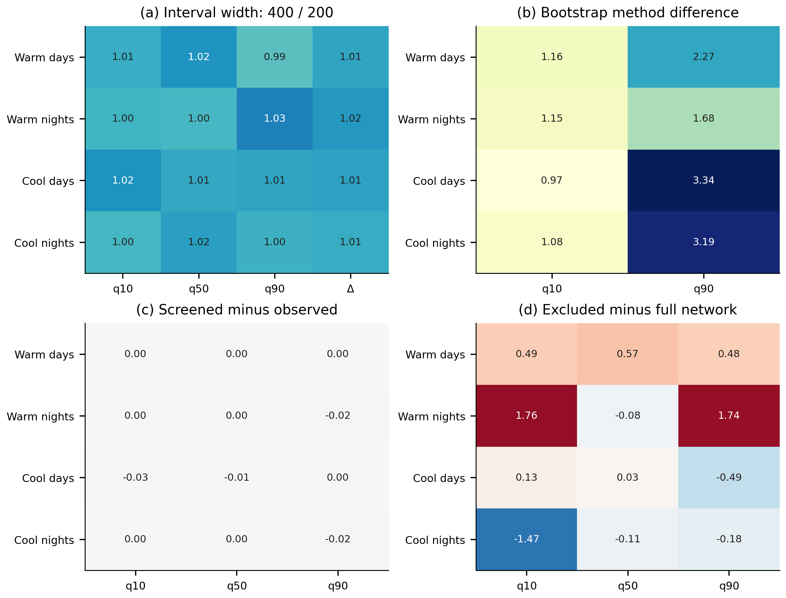
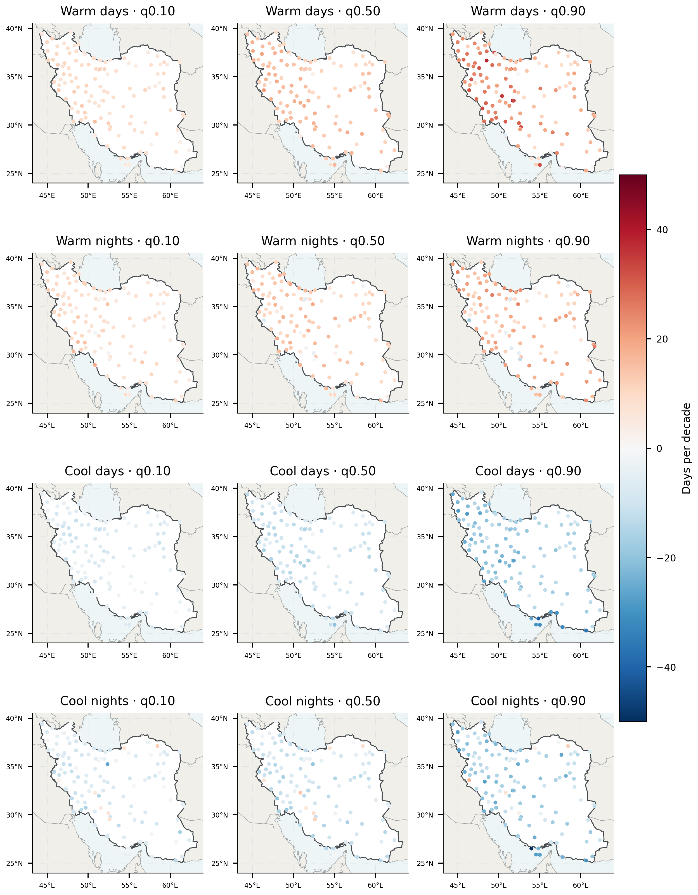
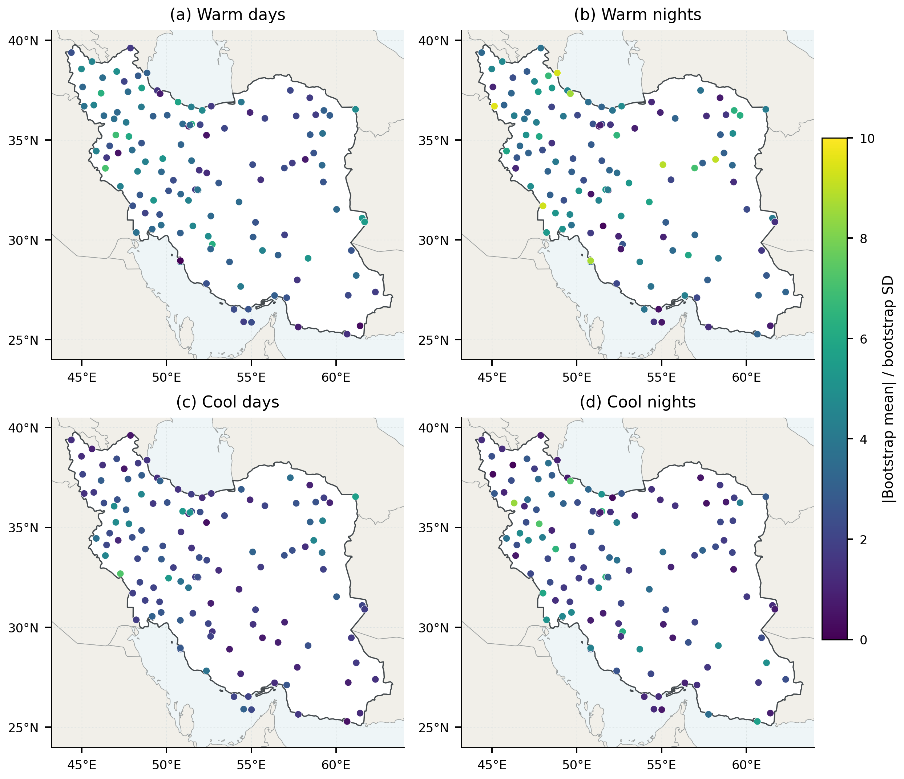
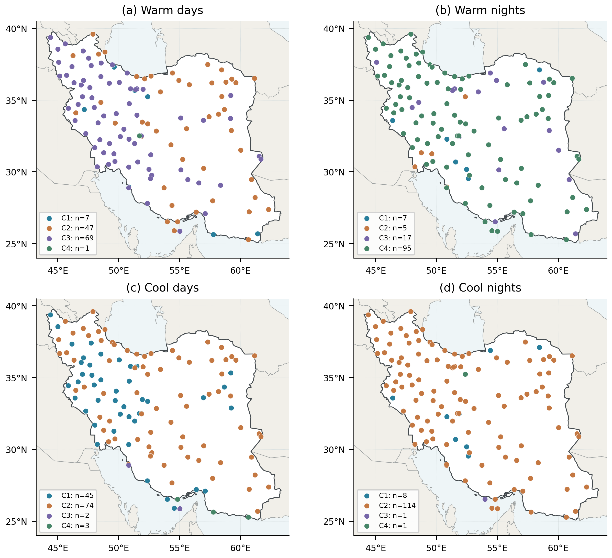
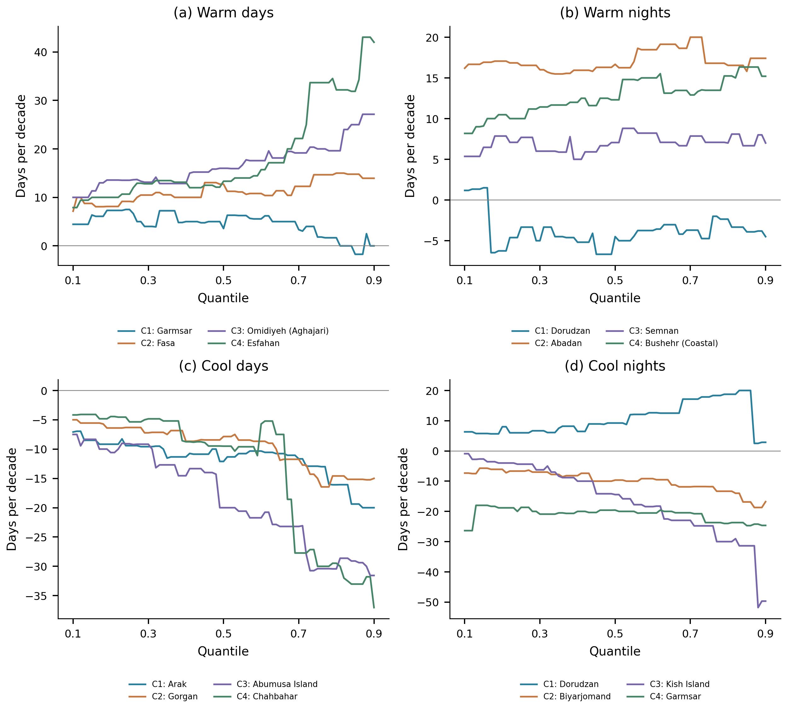
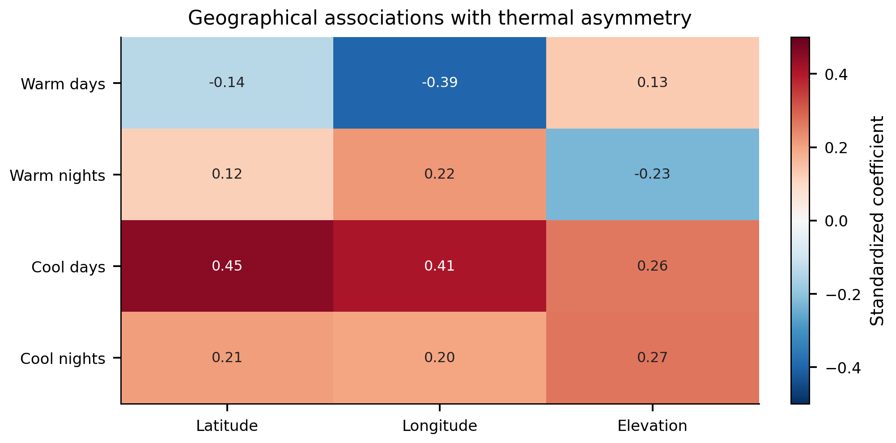
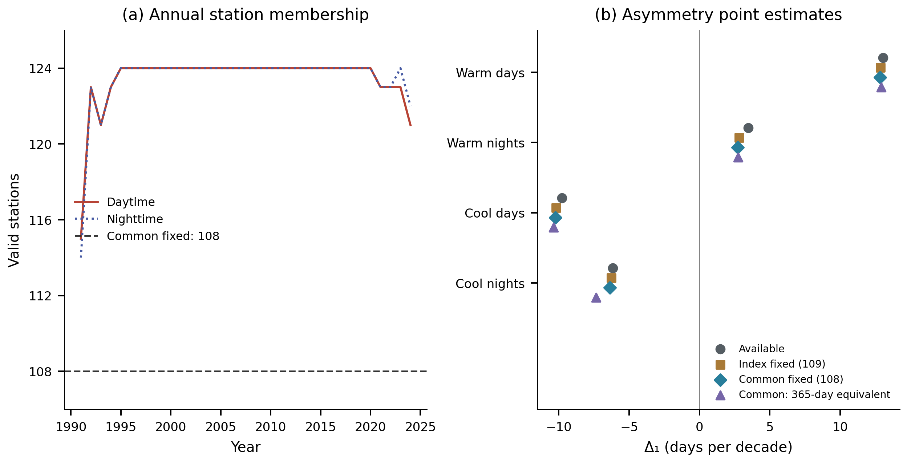
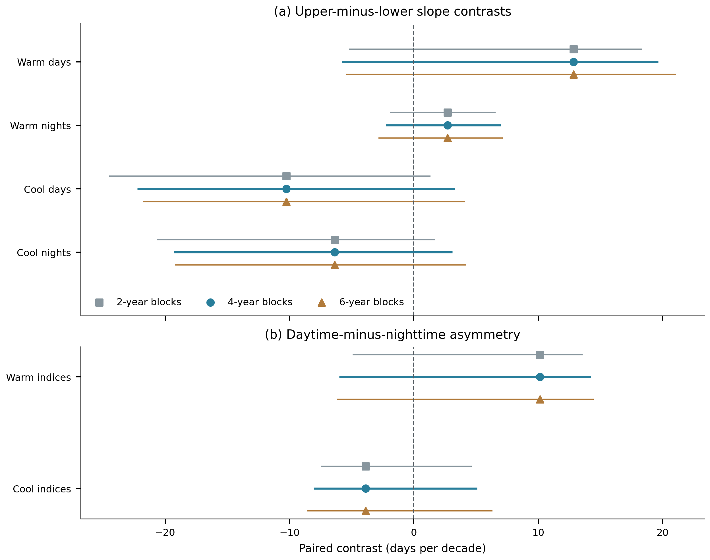
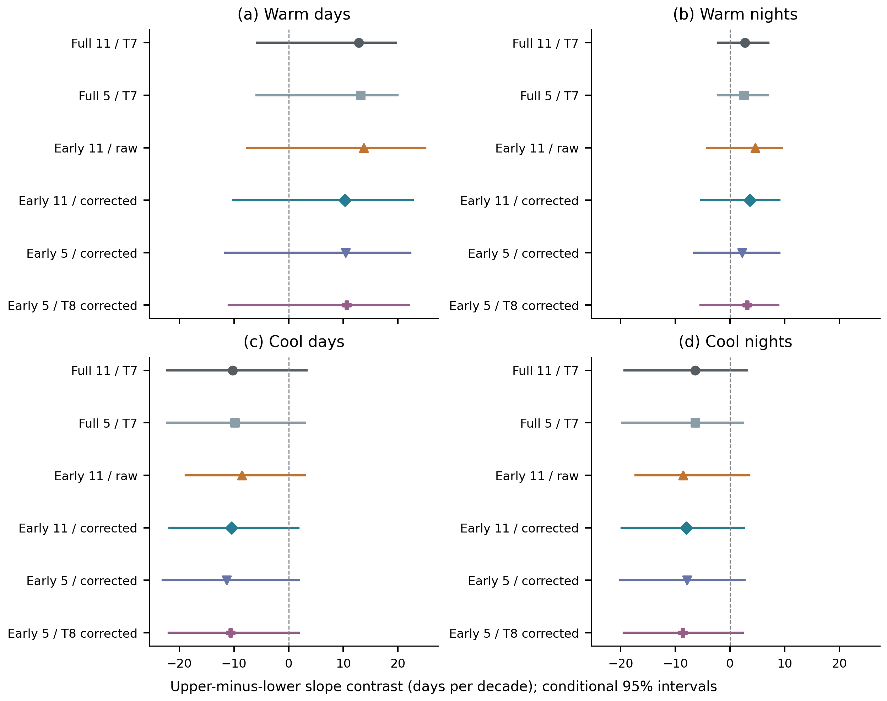
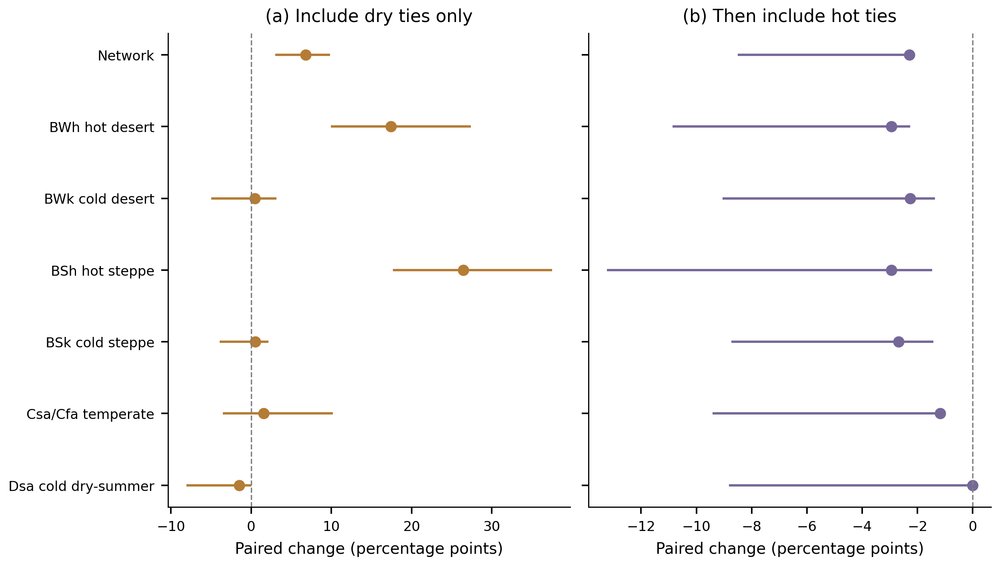

# Supporting Information: thermal extremes and explicit dry–hot concurrence

This Supporting Information accompanies [the manuscript](Manuscript_IJC_2026.md). Figures and tables were regenerated from machine-readable outputs, and the reproducibility section records their provenance and validation scope.

## S1. Additional methods and interpretation

Thermal slopes concern annual counts and use the historical day-of-year percentile construction described in the main paper. Annual station indices were independently rebuilt from daily observations. All saved 200-replicate thermal bootstrap summaries were recalculated from their individual draws. Alternative 400-replicate and maximum-entropy ensembles are represented by saved station summaries; their summary aggregation was checked, but the alternative draws were not archived and those ensembles were not rerun.

Homogeneity diagnostics use annual mean temperatures, with Pettitt, SNHT and Buishand tests after linear detrending. Their nominal flags do not identify or correct specific artificial breaks. The exclusion sensitivity describes a changed observing network, not a homogenized dataset. Calendar coverage in Figure S1 uses the new screened aggregates; historical available-row completeness is retained in the data catalog and is not substituted for calendar-day coverage.

Spatial diagnostics use five-nearest-neighbor weights and 499 label permutations. The reported Moran probabilities are exploratory across fields. Analytic station probabilities are adjusted within each index–quantile family using Benjamini–Hochberg at 0.05. Tail analytic intervals are unavailable in the archived estimates; NA is retained instead of converting missing tests to zero. The local retained counts do not establish field significance or repair serial-dependence limitations. The precision ratio in Figure S4 is an absolute bootstrap mean divided by bootstrap standard deviation; it must not be interpreted as a time of emergence.

Clustering uses standardized station quantile slopes, average linkage, Euclidean distance and four requested groups per index. Features with absolute correlation at least 0.95 are screened in the configured order. Alternative linkage, distance, k-means and expanded uncertainty-feature choices test sensitivity; adjusted Rand index is used because raw label agreement depends on arbitrary cluster numbering. Cluster composites describe fitted groups, including any singleton clusters, rather than independently validated climate regions. Representatives are observed stations nearest fitted cluster centroids. They illustrate heterogeneity without adding independent inferential evidence.

Geographical regressions and regressions on the internally derived temperature anomaly remain descriptive. The latter share observations and trends with their outcomes. Historical composite “fingerprint” scores combine overlapping diagnostics and their circular-shift null shifts indices independently. They are excluded from the active supplementary evidence because neither the aggregate score nor that null supplies an independent attribution test. Their original files are recorded in the recovery manifest.

Historical empirical joint-rarity analyses use an observation-specific inverse joint probability and available-row completeness. Their yearly networks vary; no stable design return period, fixed marginal AND event, physical affected area or causal “driver” is inferred. Figure S10 preserves this analysis only to demonstrate the effect of event definition.

The primary thermal network analysis is distinct from those historical station summaries. It uses the common 108 stations meeting annual-index coverage in all 34 years for all four indices. Each index-specific complete set has 109 stations. Available, index-specific fixed, common fixed and 365-day-equivalent series are archived separately. The latter scales observed counts by 365/valid days and assumes representative missing days; it is not an imputed record.

Network intervals use 4,999 synchronized circular moving-block pairs draws of original calendar year and response field. Original time covariates are retained rather than reassigning sampled responses to a new time axis. All indices and network definitions share the saved sampled year positions. Four-year blocks are primary; two- and six-year blocks are sensitivities. Daily thresholds and station selection are held fixed. OLS, three focal quantile slopes, within-index upper-minus-lower contrasts and paired day-minus-night contrasts are saved for every replicate. The full primary quantile grid has pointwise 95% bands. Nominal family intervals in Table S10 use a six-contrast Bonferroni adjustment, separate from the compound family in Table S1. No exact short-record coverage is claimed. Independent linear programming checks the weighted check-loss minimizer and saved replicate coefficients; membership, means, contrasts and interval arithmetic are also checked by `validate_thermal_network.py`.

Index-construction sensitivities use the same 108-station daily records and masks. Each early-reference target year is removed and replaced by each of the other 16 years in turn; events are counted separately and counts averaged. The late-period cutoffs use the unchanged original reference. This deterministic correction is distinct from the conditional uncertainty bootstrap applied to completed annual indices. The primary full-record construction remains the estimand of Figure 2/Table 1; corrected early-reference differences supersede uncorrected headline period changes in Figure 4. Definitions and quantitative comparisons are in Tables S12–S13.

Structural-zero analyses keep observed-zero/positive strata fixed while varying strict, dry-inclusive-only and both-inclusive rules on identical station sets. For observed strict cutoffs, every zero-cutoff station has zero dry/joint frequency and zero partition components. Full-network point estimates are therefore weighted positive-subset means, exactly. Fixed-threshold draws retain this identity. Refitted cutoffs can become positive at originally zero-cutoff stations, giving nonzero bootstrap contributions; interval endpoints then cannot be rescaled mechanically. Paired rule-effect intervals use the same year draws and retain cross-variable dependence. They remain exploratory: for example, the summer additional hot-tie estimate is −2.28 percentage points while its percentile interval is [−8.51, −2.34], showing bootstrap centering displacement in this discrete short-baseline statistic. This behavior is reported rather than treating every percentile interval as calibrated confirmation.

## S2. Numerical evidence

### Table S1. Primary compound partition with pointwise and family intervals

All entries are percentage points. Pointwise intervals use the 2.5th and 97.5th percentiles of 4,999 synchronized circular-block replicates. Family intervals use the 0.3125th and 99.6875th percentiles for eight primary quantities. Thresholds are re-estimated in each replicate. Nominal multiplicity adjustment does not guarantee exact coverage in short discrete series.

| Period | Component | Estimate | 95% lower | 95% upper | Family lower | Family upper |
| --- | --- | --- | --- | --- | --- | --- |
| Annual | Joint frequency | 20.645 | 9.219 | 40.837 | 5.826 | 47.045 |
| Annual | Dry-frequency term | 8.183 | 4.179 | 18.614 | 3.032 | 22.561 |
| Annual | Hot-frequency term | 12.482 | 6.159 | 23.445 | 4.241 | 26.974 |
| Annual | Excess-joint term | -0.020 | -4.349 | 3.417 | -5.959 | 4.709 |
| June–September | Joint frequency | 12.850 | 7.196 | 27.184 | 5.311 | 32.610 |
| June–September | Dry-frequency term | 2.886 | 0.531 | 10.429 | -0.315 | 12.885 |
| June–September | Hot-frequency term | 9.907 | 5.791 | 16.289 | 4.485 | 18.852 |
| June–September | Excess-joint term | 0.057 | -1.787 | 2.365 | -2.469 | 3.527 |

### Table S2. Joint-frequency sensitivity

Changing coverage, thresholds or station selection changes the estimand. Scenario intervals are exploratory rather than independent confirmations.

| Period | Scenario | N | Estimate | 95% lower | 95% upper |
| --- | --- | --- | --- | --- | --- |
| Annual | primary | 104 | 20.645 | 9.219 | 40.837 |
| June–September | primary | 103 | 12.850 | 7.196 | 27.184 |
| Annual | tails 20 80 | 104 | 17.760 | 5.882 | 35.011 |
| June–September | tails 20 80 | 103 | 10.965 | 5.251 | 23.701 |
| Annual | tails 30 70 | 104 | 20.362 | 8.371 | 42.195 |
| June–September | tails 30 70 | 103 | 14.449 | 7.367 | 29.812 |
| Annual | coverage 90 | 86 | 22.093 | 9.781 | 42.616 |
| June–September | coverage 90 | 101 | 12.930 | 7.338 | 26.791 |
| Annual | block 2 | 104 | 20.645 | 8.710 | 40.218 |
| June–September | block 2 | 103 | 12.850 | 7.539 | 25.985 |
| Annual | block 6 | 104 | 20.645 | 10.068 | 40.781 |
| June–September | block 6 | 103 | 12.850 | 6.796 | 27.473 |
| Annual | fixed threshold uncertainty | 104 | 20.645 | 6.895 | 33.544 |
| June–September | fixed threshold uncertainty | 103 | 12.850 | 6.168 | 19.589 |
| Annual | inclusive ties | 104 | 16.346 | 0.619 | 33.371 |
| June–September | inclusive ties | 103 | 17.362 | 5.540 | 30.097 |
| Annual | positive dry threshold | 104 | 20.645 | 9.219 | 40.837 |
| June–September | positive dry threshold | 75 | 17.647 | 9.725 | 33.804 |
| Annual | common station network | 101 | 20.617 | 8.911 | 41.118 |
| June–September | common station network | 101 | 13.104 | 7.335 | 27.490 |

### Table S3. Daily internal-consistency screening

Screening actions apply to the new compound extension and the explicit historical sensitivity, not retroactively to all historical thermal results.

| Screen | Flagged rows | Stations | Sensitivity action |
| --- | --- | --- | --- |
| tmin greater than tmax | 45 | 32 | set tmin, tmax, and tmean to missing |
| tmean outside valid min max range | 2165 | 61 | set tmean to missing |

### Table S4. Station bootstrap intervals excluding zero

Counts use pointwise 95% percentile intervals, without multiplicity adjustment. They are not equivalent to the analytic FDR counts in Table S5.

| Index | N | q10 | q50 | q90 | Δ |
| --- | --- | --- | --- | --- | --- |
| Warm days | 124 | 47 | 98 | 73 | 9 |
| Warm nights | 124 | 69 | 97 | 88 | 18 |
| Cool days | 124 | 74 | 78 | 57 | 5 |
| Cool nights | 124 | 68 | 73 | 61 | 4 |

### Table S5. Spatial diagnostics and retained local tests

Moran probabilities are nominal permutation results; dependence limitations are described in Section S1. Tail analytic intervals are unavailable: NA denotes no estimable test, not zero significant stations. Bootstrap tail uncertainty is provided separately in Table S4.

| Index | Quantile | N | Moran’s I | Permutation p | FDR retained | Available tests |
| --- | --- | --- | --- | --- | --- | --- |
| Cool days | 0.100 | 124 | 0.290 | 0.002 | NA | 0 |
| Cool nights | 0.100 | 124 | -0.011 | 0.858 | NA | 0 |
| Warm days | 0.100 | 124 | 0.258 | 0.002 | NA | 0 |
| Warm nights | 0.100 | 124 | 0.200 | 0.004 | NA | 0 |
| Cool days | 0.500 | 124 | 0.192 | 0.004 | 97 | 124 |
| Cool nights | 0.500 | 124 | 0.039 | 0.532 | 86 | 124 |
| Warm days | 0.500 | 124 | -0.023 | 0.730 | 115 | 124 |
| Warm nights | 0.500 | 124 | 0.039 | 0.546 | 104 | 124 |
| Cool days | 0.900 | 124 | 0.348 | 0.002 | NA | 0 |
| Cool nights | 0.900 | 124 | 0.108 | 0.058 | NA | 0 |
| Warm days | 0.900 | 124 | 0.166 | 0.008 | NA | 0 |
| Warm nights | 0.900 | 124 | 0.114 | 0.056 | NA | 0 |

### Table S6. Clustering sensitivity: adjusted Rand index

Agreement with the baseline partition. Values near one indicate similar assignments; low agreement cautions against treating the partition as uniquely determined.

| Index | Average / cityblock | Complete / Euclidean | Ward / Euclidean | k-means | Expanded features |
| --- | --- | --- | --- | --- | --- |
| Cool days | 0.447 | 0.458 | 0.409 | 0.356 | 0.065 |
| Cool nights | 1.000 | 0.210 | 0.123 | 0.130 | 0.941 |
| Warm days | 0.979 | 0.689 | 0.845 | 0.626 | 0.153 |
| Warm nights | 0.940 | 0.176 | 0.530 | 0.342 | 0.488 |

### Table S7. Exploratory spatial compactness of clusters

The statistic is mean within-cluster geographical distance, compared with 499 permutations of cluster labels. These nominal probabilities do not validate the fitted groups as physical climate regions.

| Index | Clusters | Observed distance (km) | Permuted distance (km) | Compactness p |
| --- | --- | --- | --- | --- |
| Cool days | 4 | 707.642 | 736.193 | 0.008 |
| Cool nights | 4 | 747.166 | 736.675 | 0.894 |
| Warm days | 4 | 664.927 | 736.843 | 0.002 |
| Warm nights | 4 | 750.505 | 735.851 | 0.882 |

### Table S8. Compound-frequency change in each climate regime

Equal-station within-group means and exploratory 95% synchronized-block intervals; annual and summer sample sizes differ. The complete four-component results are in the linked data catalog.

| Period | Climate regime | N | N₀ | Estimate | 95% lower | 95% upper |
| --- | --- | --- | --- | --- | --- | --- |
| Annual | BWh: hot desert | 28 | 0 | 20.588 | 11.555 | 39.916 |
| Annual | BWk: cold desert | 12 | 0 | 25.000 | 6.863 | 47.549 |
| Annual | BSh: hot steppe | 7 | 0 | 36.134 | 18.487 | 59.664 |
| Annual | BSk: cold steppe | 33 | 0 | 17.112 | 3.565 | 42.602 |
| Annual | C: temperate | 15 | 0 | 16.863 | 6.275 | 35.294 |
| Annual | Dsa: cold, dry summer | 9 | 0 | 22.222 | 5.229 | 53.595 |
| June–September | BWh: hot desert | 26 | 17 | 5.204 | 2.715 | 14.027 |
| June–September | BWk: cold desert | 13 | 2 | 9.502 | 2.692 | 23.529 |
| June–September | BSh: hot steppe | 8 | 5 | 5.882 | 2.206 | 16.912 |
| June–September | BSk: cold steppe | 33 | 3 | 16.221 | 7.130 | 34.225 |
| June–September | C: temperate | 15 | 1 | 20.784 | 6.275 | 44.706 |
| June–September | Dsa: cold, dry summer | 8 | 0 | 21.324 | 10.294 | 45.588 |

### Table S9. Thermal trend sensitivity to network definition

All slopes and contrasts are in days per decade. Available networks contain 115–124 daytime or 114–124 nighttime stations per year; index-specific fixed sets contain 109 and the common set contains 108. Common 365-equivalent denotes the coverage-scaled diagnostic described in Section S1. These point estimates do not replace the primary intervals in Table 1.

| Index | network | OLS | q10 | q50 | q90 | Δ |
| --- | --- | --- | --- | --- | --- | --- |
| Warm days | available | 14.022 | 9.446 | 15.550 | 22.505 | 13.058 |
| Warm days | index fixed | 13.974 | 9.558 | 15.824 | 22.436 | 12.878 |
| Warm days | common fixed | 13.949 | 9.521 | 15.719 | 22.370 | 12.850 |
| Warm days | common 365 equivalent | 13.956 | 9.501 | 15.779 | 22.419 | 12.918 |
| Warm nights | available | 10.958 | 8.742 | 12.139 | 12.211 | 3.469 |
| Warm nights | index fixed | 11.008 | 9.761 | 12.110 | 12.585 | 2.824 |
| Warm nights | common fixed | 11.137 | 10.069 | 12.341 | 12.778 | 2.708 |
| Warm nights | common 365 equivalent | 10.966 | 9.951 | 12.137 | 12.692 | 2.740 |
| Cool days | available | -12.598 | -5.602 | -12.001 | -15.372 | -9.770 |
| Cool days | index fixed | -12.617 | -5.467 | -11.923 | -15.661 | -10.194 |
| Cool days | common fixed | -12.613 | -5.455 | -11.948 | -15.696 | -10.241 |
| Cool days | common 365 equivalent | -12.770 | -5.551 | -12.109 | -15.916 | -10.365 |
| Cool nights | available | -10.863 | -5.905 | -9.832 | -12.065 | -6.159 |
| Cool nights | index fixed | -10.905 | -5.923 | -9.531 | -12.196 | -6.273 |
| Cool nights | common fixed | -10.966 | -5.905 | -9.600 | -12.272 | -6.366 |
| Cool nights | common 365 equivalent | -11.559 | -6.297 | -10.067 | -13.638 | -7.341 |

### Table S10. Primary paired thermal contrasts with uncertainty

Days per decade on the common 108-station network. Pointwise intervals use 2.5th/97.5th percentiles and nominal six-contrast family intervals use 0.4167th/99.5833rd percentiles of 4,999 synchronized four-year block replicates. Day-minus-night comparisons use signed Δ₁, including for cool indices. All six intervals include zero; this does not establish equal slopes or equal asymmetry. Family columns stored for other networks or metrics are not part of this primary inferential family.

| Contrast | Estimate | 95% lower | 95% upper | Family lower | Family upper |
| --- | --- | --- | --- | --- | --- |
| Warm days Δ₁ | 12.850 | -5.756 | 19.664 | -10.795 | 24.994 |
| Warm nights Δ₁ | 2.708 | -2.238 | 6.997 | -6.183 | 9.564 |
| Cool days Δ₁ | -10.241 | -22.235 | 3.281 | -27.154 | 7.544 |
| Cool nights Δ₁ | -6.366 | -19.300 | 3.114 | -22.714 | 6.424 |
| Warm Δ₁: day minus night | 10.142 | -5.994 | 14.240 | -8.205 | 17.704 |
| Cool Δ₁: day minus night | -3.875 | -8.046 | 5.087 | -11.435 | 8.366 |

### Table S11. Leave-one-year-out thermal point estimates

Minimum and maximum estimates across 34 fits, each omitting one original year from the common-network series and retaining the other calendar-year covariates. Units are days per decade. These ranges describe influence and are not confidence intervals. Omitted-year coefficients for all focal quantiles are archived in the data catalog.

| Index | q90_min | q90_max | Delta1_min | Delta1_max |
| --- | --- | --- | --- | --- |
| Warm days | 11.839 | 22.701 | 2.318 | 13.389 |
| Warm nights | 11.380 | 13.441 | 1.310 | 3.811 |
| Cool days | -15.976 | -10.489 | -11.452 | -5.035 |
| Cool nights | -13.947 | -11.537 | -8.041 | -4.343 |

### Table S12. Controlled thermal-index constructions

All six scenarios use the same 108 stations, strict inequalities, no leap days and at least 80% valid annual days. They report observed annual counts and, separately, percentages of valid days. The 5-day/T8 corrected sensitivity follows the percentile and in-base replacement conventions used in climdex, but uses a 17-year baseline and the study’s annual coverage rule; it is not a fully standard ETCCDI implementation with standard baseline and monthly completeness requirements. Historical T7 uses linear interpolation between sample order statistics; T8 uses the median-unbiased convention. No sparse reference window triggered the minimum-15-observation guard.

| Scenario | Reference | Window (days) | Quantile type | In-base correction |
| --- | --- | --- | --- | --- |
| full w11 t7 | 1991–2024 | 11 | T7 | None |
| full w5 t7 | 1991–2024 | 5 | T7 | None |
| fixed w11 t7 raw | 1991–2007 | 11 | T7 | None |
| fixed w11 t7 corrected | 1991–2007 | 11 | T7 | 16 donor replacements |
| fixed w5 t7 corrected | 1991–2007 | 5 | T7 | 16 donor replacements |
| fixed w5 t8 corrected | 1991–2007 | 5 | T8 | 16 donor replacements |

### Table S13. Thermal period changes and trend sensitivity

Period differences are 2008–2024 minus 1991–2007 means, averaging stations equally on the common 108-station network. Count changes are days per year; rate changes are percentage points of valid observed days. Slopes and Δ₁ intervals are days per decade. Corrected baseline counts may be fractional because event counts, not thresholds, are averaged over donor replacements. Intervals are conditional sensitivity intervals, not independent tests.

| Scenario | Index | Count change | Valid-day rate change | q10 slope | q90 slope | Δ₁ [95% interval] |
| --- | --- | --- | --- | --- | --- | --- |
| full w11 t7 | Warm days | 23.004 | 6.296 | 9.521 | 22.370 | 12.85 [-5.76, 19.66] |
| full w11 t7 | Warm nights | 18.041 | 4.852 | 10.069 | 12.778 | 2.71 [-2.24, 7.00] |
| full w11 t7 | Cool days | -17.578 | -4.889 | -5.455 | -15.696 | -10.24 [-22.23, 3.28] |
| full w11 t7 | Cool nights | -15.592 | -4.528 | -5.905 | -12.272 | -6.37 [-19.30, 3.11] |
| full w5 t7 | Warm days | 23.565 | 6.450 | 9.897 | 23.023 | 13.13 [-5.87, 19.89] |
| full w5 t7 | Warm nights | 17.907 | 4.813 | 10.171 | 12.691 | 2.52 [-2.22, 6.98] |
| full w5 t7 | Cool days | -17.926 | -4.985 | -5.838 | -15.687 | -9.85 [-22.22, 3.03] |
| full w5 t7 | Cool nights | -15.833 | -4.599 | -5.936 | -12.333 | -6.40 [-19.77, 2.42] |
| fixed w11 t7 raw | Warm days | 37.167 | 10.181 | 17.371 | 31.102 | 13.73 [-7.57, 25.00] |
| fixed w11 t7 raw | Warm nights | 29.264 | 7.897 | 15.861 | 20.467 | 4.61 [-4.19, 9.51] |
| fixed w11 t7 raw | Cool days | -10.783 | -3.009 | -3.325 | -11.880 | -8.56 [-18.80, 2.92] |
| fixed w11 t7 raw | Cool nights | -8.237 | -2.456 | -3.349 | -11.944 | -8.60 [-17.30, 3.49] |
| fixed w11 t7 corrected | Warm days | 32.708 | 8.949 | 17.086 | 27.373 | 10.29 [-10.11, 22.69] |
| fixed w11 t7 corrected | Warm nights | 25.944 | 6.971 | 14.429 | 18.087 | 3.66 [-5.26, 9.00] |
| fixed w11 t7 corrected | Cool days | -14.929 | -4.154 | -3.979 | -14.390 | -10.41 [-21.78, 1.78] |
| fixed w11 t7 corrected | Cool nights | -12.132 | -3.548 | -3.960 | -11.944 | -7.98 [-19.83, 2.52] |
| fixed w5 t7 corrected | Warm days | 33.427 | 9.142 | 16.867 | 27.277 | 10.41 [-11.62, 22.23] |
| fixed w5 t7 corrected | Warm nights | 26.460 | 7.097 | 16.065 | 18.264 | 2.20 [-6.54, 9.04] |
| fixed w5 t7 corrected | Cool days | -16.446 | -4.575 | -4.537 | -15.845 | -11.31 [-23.01, 1.90] |
| fixed w5 t7 corrected | Cool nights | -13.261 | -3.879 | -4.466 | -12.333 | -7.87 [-20.06, 2.69] |
| fixed w5 t8 corrected | Warm days | 32.642 | 8.929 | 16.698 | 27.311 | 10.61 [-10.92, 21.96] |
| fixed w5 t8 corrected | Warm nights | 25.714 | 6.904 | 15.079 | 18.227 | 3.15 [-5.41, 8.81] |
| fixed w5 t8 corrected | Cool days | -15.366 | -4.275 | -4.251 | -14.859 | -10.61 [-21.94, 1.84] |
| fixed w5 t8 corrected | Cool nights | -12.366 | -3.619 | -3.860 | -12.519 | -8.66 [-19.41, 2.32] |

### Table S14. Structural-zero dilution and tie definitions within climate regimes

Joint-frequency changes in percentage points with exploratory 95% refitted-threshold intervals. N+ is the fixed observed-positive-cutoff subset. All strict point estimates equal N+/N times the positive-subset point estimate: this is an exact reweighting identity, not independent robustness evidence. Strict and inclusive all-station rules retain identical stations. Dry-inclusive changes only precipitation equality; both-inclusive also changes temperature equality. Group intervals do not test between-group contrasts. The three-station summer BSh positive subset is especially imprecise. Fixed-threshold intervals, paired rule effects, observed-zero strata and bootstrap cutoff changes are archived separately.

| Period | Climate regime | N | N₀ | N+ | Strict all | Strict positive subset | Dry-inclusive all | Both-inclusive all |
| --- | --- | --- | --- | --- | --- | --- | --- | --- |
| Annual | All | 104 | 0 | 104 | 20.64 [9.22, 40.84] | 20.64 [9.22, 40.84] | 18.67 [6.00, 38.35] | 16.35 [0.62, 33.37] |
| Annual | BWh: hot desert | 28 | 0 | 28 | 20.59 [11.55, 39.92] | 20.59 [11.55, 39.92] | 18.91 [8.82, 36.97] | 16.60 [3.56, 31.09] |
| Annual | BWk: cold desert | 12 | 0 | 12 | 25.00 [6.86, 47.55] | 25.00 [6.86, 47.55] | 21.57 [3.43, 45.59] | 19.12 [-0.49, 40.20] |
| Annual | BSh: hot steppe | 7 | 0 | 7 | 36.13 [18.49, 59.66] | 36.13 [18.49, 59.66] | 33.61 [15.97, 57.14] | 30.25 [11.76, 53.78] |
| Annual | BSk: cold steppe | 33 | 0 | 33 | 17.11 [3.57, 42.60] | 17.11 [3.57, 42.60] | 15.69 [0.36, 40.29] | 14.26 [-4.99, 35.83] |
| Annual | C: temperate | 15 | 0 | 15 | 16.86 [6.27, 35.29] | 16.86 [6.27, 35.29] | 14.51 [2.35, 32.16] | 11.76 [-3.14, 28.25] |
| Annual | Dsa: cold, dry summer | 9 | 0 | 9 | 22.22 [5.23, 53.59] | 22.22 [5.23, 53.59] | 20.26 [2.61, 50.98] | 16.34 [-8.50, 47.71] |
| June–September | All | 103 | 28 | 75 | 12.85 [7.20, 27.18] | 17.65 [9.73, 33.80] | 19.65 [11.25, 34.33] | 17.36 [5.54, 30.10] |
| June–September | BWh: hot desert | 26 | 17 | 9 | 5.20 [2.71, 14.03] | 15.03 [7.19, 27.45] | 22.62 [15.16, 36.43] | 19.68 [8.37, 31.45] |
| June–September | BWk: cold desert | 13 | 2 | 11 | 9.50 [2.69, 23.53] | 11.23 [2.67, 27.81] | 9.95 [-0.45, 24.43] | 7.69 [-5.88, 20.38] |
| June–September | BSh: hot steppe | 8 | 5 | 3 | 5.88 [2.21, 16.91] | 15.69 [5.88, 39.22] | 32.35 [22.79, 50.00] | 29.41 [16.91, 44.12] |
| June–September | BSk: cold steppe | 33 | 3 | 30 | 16.22 [7.13, 34.22] | 17.84 [7.65, 34.51] | 16.76 [5.53, 33.16] | 14.08 [1.25, 29.23] |
| June–September | C: temperate | 15 | 1 | 14 | 20.78 [6.27, 44.71] | 22.27 [6.72, 44.96] | 22.35 [10.59, 43.53] | 21.18 [4.71, 39.22] |
| June–September | Dsa: cold, dry summer | 8 | 0 | 8 | 21.32 [10.29, 45.59] | 21.32 [10.29, 45.59] | 19.85 [5.15, 43.38] | 19.85 [0.74, 40.44] |

### Table S15. Comparison with prior studies and specific added evidence

The comparisons are contextual rather than formal between-study tests because periods, spatial supports, preprocessing, and estimands differ.

| Study | Prior scope | Present evidence and interpretation |
| --- | --- | --- |
| Rahimzadeh et al. (2009) | Quality-controlled ETCCDI indices at 27 Iranian stations showed more warm and fewer cool extremes. | The direction agrees, while the present 124-station archive adds fixed-network count quantiles, construction sensitivity, and compound concurrence. |
| Rahimzadeh and Nassaji Zavareh (2014) | Adjustment of non-climatic discontinuities affected Iranian temperature trends. | The present daily archive is not metadata-homogenized; exclusion sensitivity cannot substitute for adjustment and limits trend interpretation. |
| Donat et al. (2014) | Regional station evidence showed widespread warming-consistent extremes but spatially variable precipitation responses. | The Iranian results fit that broad context while explicitly separating dry- and hot-frequency components. |
| Yosef et al. (2021) | Percentile-index trend magnitudes were sensitive to base-period choice, especially in 30–40-year studies. | Six controlled constructions quantify reference, window, quantile-convention, and in-base effects on identical stations. |
| Fan (2014) | Chinese annual counts showed increasing warm nights but little cool-day tail change. | Iranian cool-day q10/q90 slopes are −5.45/−15.70 days decade⁻¹, although their difference is not resolved. |
| Wu et al. (2021) | Historical and projected global land area affected by dry–hot events increased. | The present observed station analysis partitions period-frequency change rather than estimating gridded affected area or projections. |
| Alizadeh et al. (2020) | A long US archive showed increasing compound extent and a larger heat contribution. | Iranian AND-event frequency also increases, but season, record length, spatial support, and event definition preclude numerical comparison. |
| Najafi et al. (2025) | Downscaled models projected increasing Iranian warm extremes at higher warming levels. | The present study concerns observed 1991–2024 changes and does not validate or attribute future projections. |
| Zhao and Xiong (2026) | CMIP6 probability-ratio decomposition separated temperature and precipitation distribution parameters. | The present exact binary-frequency partition uses observed stations and adds tie and baseline-threshold uncertainty; it does not recover distribution-parameter contributions. |

## S3. Supplementary figures

### Figure S1. Coverage and homogeneity diagnostics

*Calendar-based valid-day fractions for temperature and precipitation, calculated from the screened aggregates for all available station-years; boxes summarize station medians. Detrended homogeneity flags use nominal p < 0.05 for annual mean temperature; flags are diagnostic, not proof of artificial breaks.*

### Figure S2. Sensitivity of thermal estimates

*(a) Mean station interval-width ratio for 400 versus 200 moving-block replicates. (b) Mean absolute difference between saved moving-block and maximum-entropy bootstrap means. (c) Change in network slopes after internal-consistency screening. (d) Change after excluding homogeneity-flagged stations. Units in (b–d) are days per decade. Panels (c–d) use the historical available network, not the primary fixed 108-station network. The two historical alternative bootstrap ensembles were checked through their saved station summaries, not regenerated.*

### Figure S3. Station quantile slopes

*Station estimates at the 0.10, 0.50 and 0.90 quantiles of annual thermal counts, on one common symmetric scale. No interpolation, area weighting or local significance symbols are used. Units are days per decade.*

### Figure S4. Bootstrap precision of median trends

*Absolute bootstrap mean divided by bootstrap standard deviation at the median. This descriptive precision ratio is dimensionless; it is neither an emergence date nor a calibrated detection probability. No threshold-based significance labels are shown.*

### Figure S5. Spatial dependence and multiplicity

*(a) Moran’s I with five-nearest-neighbor weights. (b) Numbers of locally retained tests after Benjamini–Hochberg adjustment separately within each index–quantile family. NA means analytic tail intervals and tests are unavailable, not that zero stations are significant. Historical analytic probabilities are approximate and do not adjust for serial dependence. These counts do not constitute a field-significance test; permutation probabilities are tabulated separately.*

### Figure S6. Exploratory cluster composites

*Median station slopes and upper-minus-lower contrasts within four fitted clusters per index. Cluster labels are specific to each index and have no shared climatic ordering. Cluster separation is partly induced by the fitted features and is not independent validation; single-station groups remain visible through their sample sizes.*

### Figure S7. Exploratory cluster membership

*Station assignments from standardized, screened quantile-slope features and average-linkage Euclidean clustering. Colors distinguish categories only within each panel; clusters are not fixed climate regions. Alternative-method agreement and within-cluster sample sizes are reported in the supplementary tables.*

### Figure S8. Representative station profiles

*One observed station per index-specific cluster, selected by the archived nearest-centroid rule. Lines show the full 0.10–0.90 quantile profile. These selected illustrations are not additional independent discoveries; all station coefficients and bootstrap intervals are available in the data catalog.*

### Figure S9. Association with the network temperature anomaly

*(a) Internally derived annual network temperature anomaly relative to 1991–2007. (b–e) Fixed-baseline network thermal-count response coefficients at three quantiles, with available median pointwise analytic intervals, in days per degree Celsius. Tail analytic intervals are unavailable and must not be inferred from the unadorned points. The predictor and outcomes share observations and temporal trends; the associations do not attribute change to external forcing.*

### Figure S10. Historical joint-rarity sensitivity

*Percentage of the available station network exceeding three empirical inverse-joint-probability cutoffs. Labels denote within-record rarity classes, not stable design return periods. This historical calculation uses unscreened daily data, available-row coverage denominators and a varying station network. It is retained as a definition sensitivity and is distinct from the main paper’s fixed marginal AND event.*

### Figure S11. Geographical associations of thermal asymmetry

*Standardized multiple-regression coefficients relating the upper-minus-lower slope contrast to latitude, longitude and elevation. These are descriptive associations; no causal driver attribution or spatially adjusted significance is implied.*

### Figure S12. Thermal network composition and coverage sensitivity

*(a) Number of stations with valid annual counts in the available daytime and nighttime networks; the dashed line marks the fixed common set of 108. (b) Upper-minus-lower quantile slope point estimates for four network definitions. Index-specific fixed sets each contain 109 stations; their common intersection contains 108. The 365-day-equivalent diagnostic scales each common station-year count by 365/valid days and assumes representative missing days. These are sensitivity estimates, not additional significance tests. Units in (b) are days per decade.*

### Figure S13. Paired thermal contrast uncertainty and block sensitivity

*(a) Four upper-minus-lower quantile slope contrasts on the common 108-station network. (b) Paired daytime-minus-nighttime contrasts in that signed asymmetry, separately for warm and cool indices. Points and segments show estimates and pointwise 95% percentile intervals from 4,999 synchronized circular year-pairs block replicates for each block length. Original year covariates travel with responses; the same sampled years are used across indices. Four-year blocks define the primary analysis. Intervals are conditional on fixed daily thresholds and the observed station set, and all shown contrast intervals include zero. The wider nominal six-contrast family intervals for the primary analysis are in Table S10.*

### Figure S14. Asymmetry sensitivity to index construction

*Upper-minus-lower quantile slope contrasts on the same 108 stations under six index constructions. Full denotes the 1991–2024 reference; early denotes 1991–2007. Numbers 11 and 5 are total calendar-day window widths. T7 and T8 denote Hyndman–Fan linear and median-unbiased sample quantiles. Corrected early indices average target-year event counts after excluding that year and duplicating each other baseline year in turn (16 replacements); out-of-base thresholds remain fixed. Segments are exploratory pointwise 95% intervals from the same 4,999 four-year pairs-block draws applied to each constructed annual series. Index construction is held fixed inside this uncertainty resampling. These correlated sensitivities are not independent confirmations or simultaneous tests.*

### Figure S15. Paired effects of dry and hot threshold ties

*Summer joint-frequency-change differences on identical station sets and synchronized year samples. Panel (a) changes P < q25 to P ≤ q25 while retaining T > q75; panel (b) then changes T > q75 to T ≥ q75. Points and exploratory 95% percentile intervals use 4,999 synchronized four-year block replicates with threshold refitting. These are paired definition effects, not changes in the observed climate or formal between-regime tests. In zero-cutoff stations, including dry ties classifies zero-precipitation seasons as dry rather than identifying a departure below the cutoff.*

## S4. Reproducibility and complete machine-readable evidence

All retained research tables are indexed in [Supplementary_Data_Catalog.md](Supplementary_Data_Catalog.md), including station-level results, complete bootstrap draws, reference metadata and validation records. Main and supplementary graphics are available as vector PDF, editable SVG, 350-dpi PNG and 600-dpi TIFF. The [supplementary figure atlas](../outputs/publication_v2/Supplementary_Figure_Atlas.pdf) contains Figures S1–S15; the [main atlas](../outputs/publication_v2/Figure_Atlas.pdf) contains Figures 1–10. Map boundaries supply geographical context only; their external source and redistribution license still require author confirmation.

Build the extension with `python run_publication.py`, validate raw-derived thermal and compound quantities with `python validate_publication.py`, and build the curated supplementary graphics with `python build_supplementary.py`. Reproduce the thermal network extension alone with `python run_thermal_network.py` and independently verify it with `python validate_thermal_network.py`. Run index-construction and structural-zero sensitivities with `python run_index_definition.py` and `python run_zero_threshold.py`; check both using `python validate_index_zero.py`. Rebuild text and atlases with `python build_publication_docs.py`. The wider historical numerical audit is reproduced with `python audit_output_data.py recompute`; it writes to an isolated work directory and never overwrites research outputs. Cleanup follows a file-specific manifest, with a verified recovery archive before deletion.
